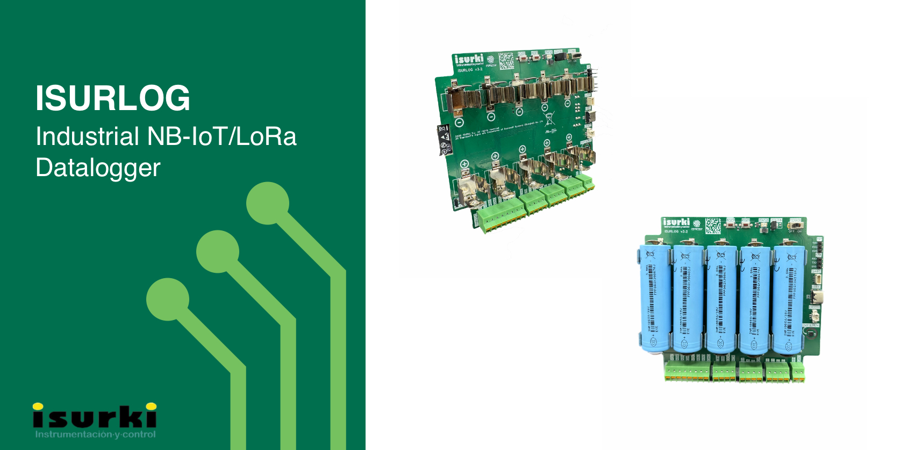

# ISURLOG Firmware

Open-source MicroPython firmware for the **ISURLOG**, ISURKI's industrial IoT datalogger.

🌐 **Read in your language** *(auto-translated via Google Translate)*: [Español](https://translate.google.com/translate?sl=en&tl=es&u=https://github.com/isurki-tecnica/isurlog-firmware) · [Français](https://translate.google.com/translate?sl=en&tl=fr&u=https://github.com/isurki-tecnica/isurlog-firmware) · [Euskara](https://translate.google.com/translate?sl=en&tl=eu&u=https://github.com/isurki-tecnica/isurlog-firmware) · [Català](https://translate.google.com/translate?sl=en&tl=ca&u=https://github.com/isurki-tecnica/isurlog-firmware)

---

## What is ISURLOG?

**ISURLOG** is an ESP32-based industrial datalogger built for field deployments where power is scarce and connectivity is never guaranteed. The same board reads real industrial signals and gets its data out over whichever network is actually available at the site — NB-IoT, LoRaWAN, or Wi-Fi, exclusively per unit, plus a local Bluetooth Low Energy link for on-site setup and diagnostics.

* **Industrial-grade sensing:** 4-20 mA analog inputs, Modbus RTU (RS485), PT100/PT1000 (2/3/4-wire), digital pulse counting, internal/external temperature & humidity, an on-board accelerometer for tamper/vandalism detection, and Isurnode expansion support.
* **Built for batteries:** as low as **~20 µA** in deep sleep, with the ESP32 waking on a schedule, on an external interrupt, or on-demand from the network (eDRX/Class C). An on-board energy-harvesting charger can top up the batteries from almost anything — a 0.3V thermoelectric generator (TEG), a small 1.5V micro solar panel, a full 5V solar panel, or a plain 5V USB charger.
* **One firmware, multiple networks:** the cellular modem (Nordic nRF9151) and LoRaWAN (RAK3172, RUI3/AT) are both supported on the same PCB design — one gets soldered on at build time depending on the deployment — with Wi-Fi available where neither has coverage. The nRF9151 alone spans NB-IoT, LTE-M, DECT NR+, and satellite NTN — with NTN connectivity already implemented in firmware for true off-grid deployments. All networks enforce modern security (WPA2+, TLS, LoRaWAN OTAA).
* **Remotely manageable, not just remotely readable:** configuration, sensor setup, firmware updates (OTA and wired), and even a live MicroPython REPL are all reachable from **[IsurDASH](https://isurdash.isurki.com)**, ISURKI's cloud platform — without a truck roll.
* **Real MicroPython, not a black box:** this is a genuine fork of [MicroPython](https://micropython.org), with ISURKI's own drivers frozen into the firmware binary (`ports/esp32/modules/`) and the application logic (`app/main.py` + its two config files) deployed on top, either via IsurDASH's guided upload or manually — readable, debuggable, and hackable at every layer, not a proprietary firmware blob.
* **Open data, no lock-in:** integrate directly with historical (InfluxDB) or real-time (MQTT) data access — see the reference implementations in the docs, including a live public demo you can query with zero setup.

---

## See It in Action

Don't just take our word for it — try the real platform and pull real data yourself, no signup required:

* **IsurDASH demo account** — log in at [isurdash.isurki.com/login](https://isurdash.isurki.com/login) and explore the dashboard, device list, alarms, and configuration screens for yourself:
  * **Email:** `isurdash.demo@gmail.com`
  * **Password:** `TEST123456`
* **Data integration examples** — two ready-to-run Python scripts in [`data_integration/`](data_integration/), pre-filled with public demo credentials so they work immediately:
  * [`isurlog_influx_demo.py`](data_integration/isurlog_influx_demo.py) — pulls historical sensor data (including a live soil moisture probe) from InfluxDB and charts it.
  * [`isurlog_mqtt_demo.py`](data_integration/isurlog_mqtt_demo.py) — subscribes to the same device's live MQTT stream and updates the charts in real time as new readings arrive.

---

## Battery Life Calculator

How long will an ISURLOG actually last on batteries? The **[interactive Power Budget Calculator](https://isurlog.isurki.com/power-budget/)** models the full duty cycle — connectivity (NB-IoT/LTE-M, LoRaWAN, Wi-Fi), the sensors you'd configure in IsurDASH, and your battery setup (Li-Ion or Li-SOCl2) — for a real estimate instead of a rule of thumb.

---

## Get ISURLOG

ISURLOG is sold directly by ISURKI, configured for your specific connectivity (NB-IoT/LTE-M, LoRaWAN, or Wi-Fi) and sensor setup — [request a quote](mailto:tecnica@isurki.com?subject=ISURLOG%20-%20Quote%20Request&body=Hi%20ISURKI%20team%2C%0A%0AI'm%20interested%20in%20ISURLOG%20for%20the%20following%20use%20case%3A%0A%0A-%20Application%2Fenvironment%3A%20%0A-%20Approximate%20quantity%3A%20%0A-%20Preferred%20connectivity%20(NB-IoT%2FLTE-M%2C%20LoRaWAN%2C%20or%20Wi-Fi)%3A%20%0A-%20Country%2Fregion%3A%20%0A%0AThanks!) and we'll get back to you with pricing and availability. Volume discounts available.

---

## Documentation

Everything — hardware, firmware architecture, the IsurDASH platform, data integration APIs, and power consumption — lives in the **[ISURLOG Docs](https://isurlog.isurki.com/)**.

| I want to... | Start here |
| :--- | :--- |
| Install and operate an ISURLOG in the field | [2. Sensor Connections](https://isurlog.isurki.com/sensor-connections/), [5. Installation and Commissioning](https://isurlog.isurki.com/installation-commissioning/) |
| Manage a fleet from IsurDASH | [7. IsurDASH Platform](https://isurlog.isurki.com/isurdash-platform/) |
| Build, modify, or contribute to the firmware | [1. Build Environment Setup](https://isurlog.isurki.com/build-environment/), [2.1 Module & Library Reference](https://isurlog.isurki.com/module-library-reference/), [7. Contribution Guide](https://isurlog.isurki.com/contribution-guide/) |
| Pull ISURLOG data into my own systems | [9. Data Access Overview](https://isurlog.isurki.com/data-access-overview/) |
| Estimate battery life or troubleshoot a field issue | [Power Budget Calculator](https://isurlog.isurki.com/power-budget/), [Troubleshooting](https://isurlog.isurki.com/troubleshooting/) |

---

## Firmware Releases

Every release publishes ready-to-flash binaries — the ESP32 firmware, plus the NB-IoT (nRF9151) and LoRaWAN (RAK3172) modem firmware — so you don't need to compile anything unless you're modifying the firmware itself.

➡️ **[Releases](https://github.com/isurki-tecnica/isurlog-firmware/releases)**

Prefer a guided, no-cable-required update? IsurDASH can push new ESP32 firmware to a deployed device directly — see **[7.8 Device Maintenance](https://isurlog.isurki.com/isurdash-maintenance/)**.

---

## Troubleshooting

Running into an issue in the field — batteries draining faster than expected, gaps in the received data, a Modbus sensor that won't respond, or BLE that won't pair? Check the **[Troubleshooting](https://isurlog.isurki.com/troubleshooting/)** page before reaching out to support — it covers the most common causes and how to fix them, and grows as new issues come up.

---

## Roadmap

ISURLOG is an actively maintained product with real field deployments, not a prototype — development is continuous, and this table is kept honest about what's battle-tested versus what's a newer, still-hardening addition.

| Feature | Type | Status | Available Since |
| :--- | :--- | :--- | :--- |
| NB-IoT / LoRaWAN / BLE connectivity | Hardware + Firmware | ✅ Stable | v1.0.0 |
| Wi-Fi connectivity & remote REPL over Wi-Fi | Firmware | ✅ Stable | v1.0.5-beta |
| Core sensors (Analog, Digital, Modbus, PT100) | Firmware | ✅ Stable | v1.0.0 |
| Internal (SHT30) & external (BME280) temperature/humidity sensors | Firmware | ✅ Stable | v1.0.3 |
| IsurDASH integration (remote config, OTA updates, live REPL) | Firmware | ✅ Stable | v1.0.0 |
| Historical (InfluxDB) & real-time (MQTT) data access | Firmware | ✅ Stable | v1.0.0 |
| NB-IoT signal quality logging (RSRQ/RSRP) | Firmware | ✅ Stable | FW v1.1.6 |
| Configurable sensor supply voltage (9-24V) | Hardware | ✅ Stable | PCB v3.0 |
| Vandalism alert (accelerometer + GPS position) | Hardware + Firmware | ✅ Stable | PCB v3.0 · FW v1.1.6 |
| Battery type & State of Charge reporting | Hardware + Firmware | ✅ Stable | PCB v3.0 · FW v1.1.9 |
| Internal accelerometer (LIS2DH12) alarm thresholds | Firmware | ✅ Stable | FW v1.1.6 |
| Asynchronous function architecture for parallel task execution, reducing the time the datalogger is powered on | Firmware | 🧪 Experimental | v2.0.1 (pre-release) |
| Non-rechargeable Li-SOCl2 battery support | Hardware | 🧪 Experimental | PCB v3.3 |
| Larger transmission buffer using external I2C EEPROM (24LC1025), removing the current RTC RAM size limitation | Firmware | 🧪 Experimental | — |
| Accelerometer alarm → forced immediate transmission | Firmware | 🔜 Planned | — |
| Automatic NB-IoT/LTE-M connection mode | Firmware | 🔜 Planned | — |
| DECT NR+ (chip-capable via nRF9151) | Firmware | 🔜 Planned | — |
| Isurnode Modbus expansion module | Hardware + Firmware | 🔜 Planned | — |
| TinyML — on-device inference for lightweight tasks like local anomaly detection or predictive maintenance, without a round trip to the cloud | Firmware | 🔜 Planned | — |
| Migration from ESP32 to ESP32-S3 or the newly-announced ESP32-S31 (final choice not yet decided) — native USB and a RISC-V LP core in place of today's ULP FSM coprocessor | Hardware + Firmware | 🔜 Planned | — |

---

## Contributing

Bug fixes, new sensor drivers, and documentation improvements are all welcome — see the **[Contribution Guide](https://isurlog.isurki.com/contribution-guide/)** for how this repository is organized (it's a full MicroPython fork — ISURKI's own code lives in `app/` and `ports/esp32/modules/`) and how to submit a pull request.

---

## License

This project is a derivative work of [MicroPython](https://github.com/micropython/micropython) (MIT-licensed). Due to the inclusion of GPL-3.0-licensed components, the combined work is distributed under the **GNU General Public License v3.0** — see [`LICENSE`](LICENSE) for the full text.

## Quick Links

* **IsurDASH Cloud Platform:** [isurdash.isurki.com/login](https://isurdash.isurki.com/login)
* **3D-Printed Accessories:** [Printables @isurki_3854777](https://www.printables.com/@isurki_3854777/models)
* **Support:** (+34) 943-635437 · tecnica@isurki.com

---

If ISURLOG is useful or interesting to you, star the repository to follow its development.
