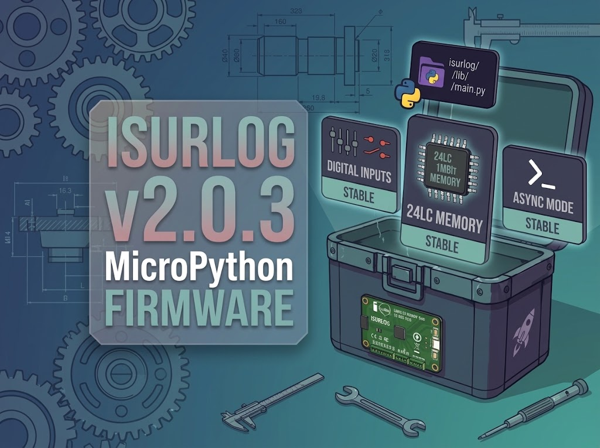

# FW v2.0.3: A Bigger Buffer Goes Stable and Digital Inputs Get Downlink Config

{width="800"}

Firmware v2.0.3 is out. Two features that have been running in the field under an "Experimental" label graduate to **Stable** in this release, and digital inputs (GP3/GP4/GP5 on the MCP23008 expander) can now be configured remotely instead of only from a fresh flash.

<!-- more -->

## What's new

### The EEPROM transmission buffer is now Stable

Since [FW v2.0.2](https://docs.isurlog.isurki.com/#roadmap), ISURLOG has been able to spill its transmission queue onto the external 24LC1025 I2C EEPROM once RTC RAM's hard ~2KB limit is reached — instead of losing readings during a connectivity outage that outlasts a handful of cycles. That mechanism has now run enough real cycles to drop the "Experimental" label.

One consequence worth knowing about even if you never touch the setting: the **Record accumulator** parameter (how many readings get batched before a transmission) can now go all the way up to **1023** — up from 255. That number isn't arbitrary: it's exactly how many payload slots fit in the 24LC1025's 128 KB at the default 128-byte payload size. Set it any higher and you'd be asking for more buffer than the chip physically has.

### Async function architecture is now Stable

The asynchronous task architecture introduced in [FW v2.0.1](https://docs.isurlog.isurki.com/#roadmap) — parallelizing sensor reads, network connection, and transmission instead of running them strictly in series — also graduates to Stable in this release. Less time with the radio and the sensor supply rails powered means less battery spent per cycle.

### Digital inputs (GP3/GP4/GP5) are now configurable via downlink

The MCP23008-based digital inputs — channels 1/2/3, alongside the native ULP-counted channel 0 — could only be set up at flash time until now. `setDigitalEnable`, `setDigitalWake`, `setDigitalLow`/`setDigitalHigh` and the rest of that command family now correctly target the right channel in `digital_config.inputs[]` instead of silently landing on the old flat, single-channel schema. If you're scripting configuration through [the downlink API](https://docs.isurlog.isurki.com/remote-configuration-api/) rather than IsurDASH's UI, this is the piece that made per-channel digital input config actually reach the device.

## Bug fixes worth knowing about

### MQTT keep-alive could exceed the protocol's own limit

`keep_alive` is derived from `latency_time × register_acumulator` — and MQTT's Keep Alive field is a 16-bit value, hard-capped at 65535 seconds. With the accumulator's new 1023 ceiling (see above), that overflow became easy to hit with an otherwise reasonable configuration, not just an edge case. `main.py` now clamps `keep_alive` to that limit and logs a warning if your configured latency/accumulator combination would have exceeded it, instead of handing the modem or `umqttsimple` a value it was never built to carry.

### MCP23008 digital inputs (GP3/GP4/GP5) could read stale polarity after certain wake paths

`input_polarity` and `interrupt_enable` on the MCP23008 expander were only guaranteed to reset when `theft_alert` was enabled — leaving GP3/GP4/GP5 dependent on whatever state the chip happened to be carrying over otherwise. `configure_input()` now forces both explicitly on every boot, regardless of the theft-alert setting.

## Upgrading

Update from **[6.8. Device Maintenance](https://docs.isurlog.isurki.com/isurdash-maintenance/#firmware-update)** in IsurDASH — over the air on FW v1.1.9+, or over USB for anything older — and pick the release marked **Latest**, not a pre-release. Manual flashing instructions are in **[Flashing and Application Upload](https://docs.isurlog.isurki.com/flashing-application-upload/)** if you're not going through IsurDASH.

Full change history: [GitHub Releases](https://github.com/isurki-tecnica/isurlog-firmware/releases).
