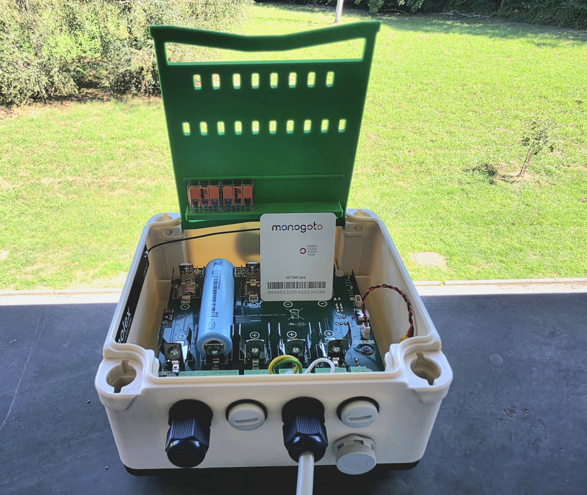
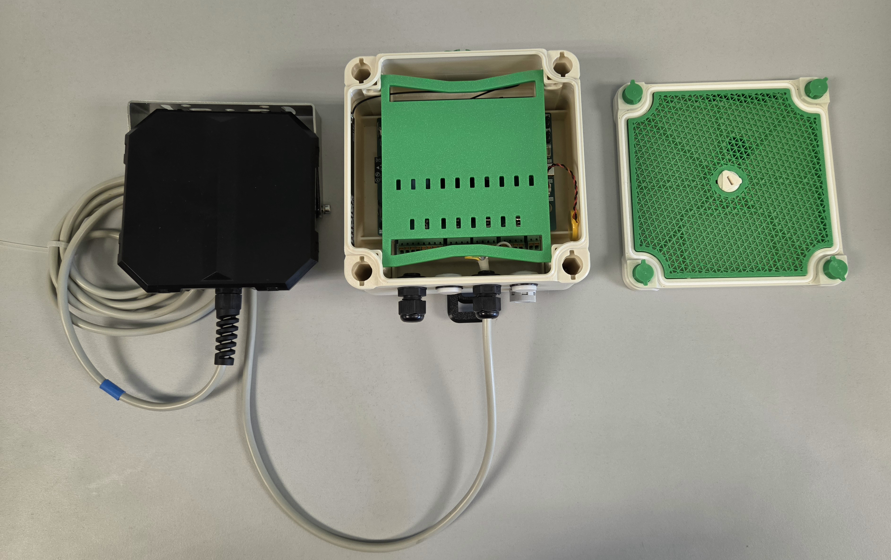
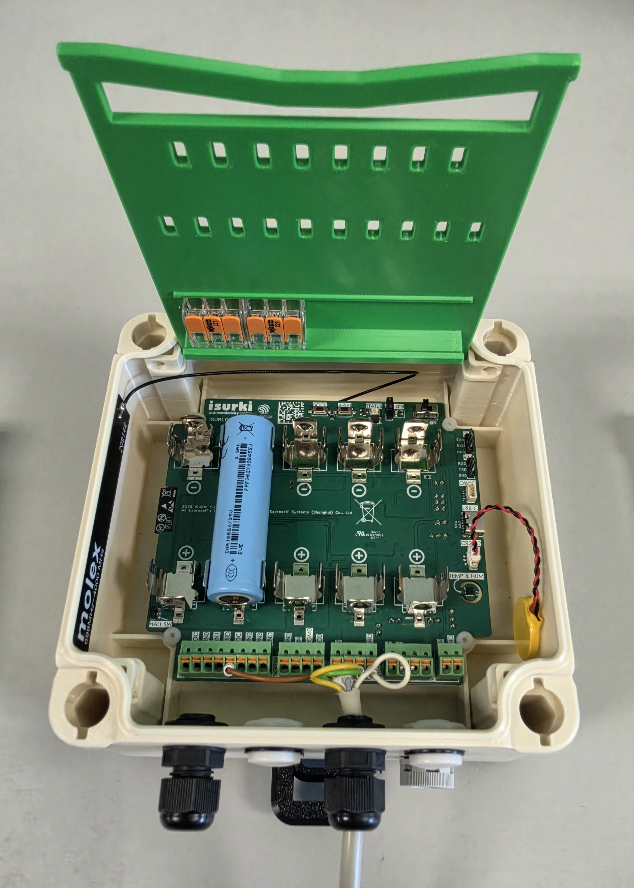
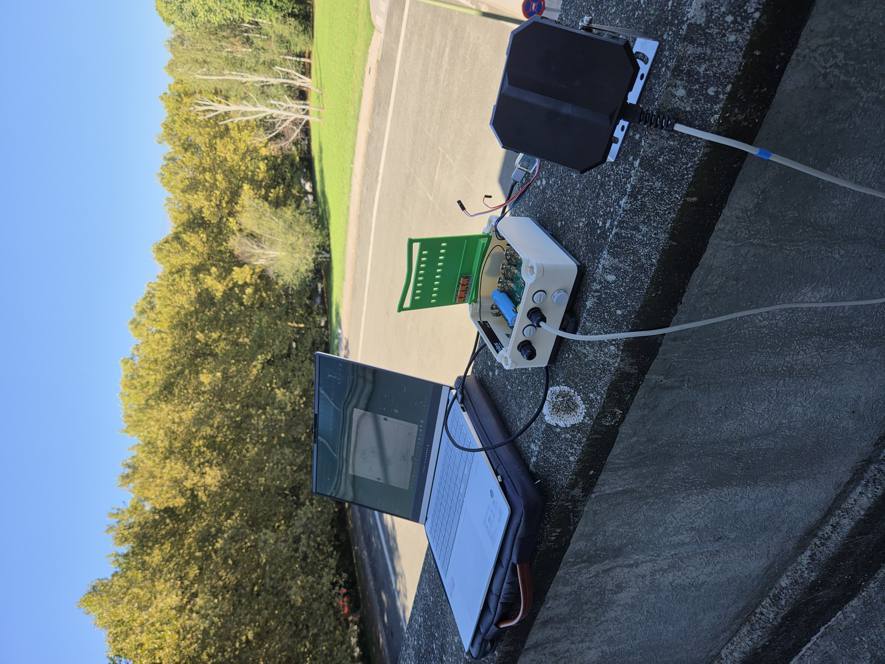

# NTN on the nRF9151: Low-Cost Satellite IoT Without a Separate Satellite Modem

{width="700"}

## Why

Satellite connectivity has always meant a trade-off nobody actually wanted to make: either your device lives in cellular coverage, or you pay for it. A dedicated satellite modem alone can cost more than an entire ISURLOG unit does today — before you've added a single sensor, an enclosure, or a battery that survives a season in the field. That cost has quietly drawn a line across the map: everything inside cellular coverage gets real-time IoT, and everything outside it — the forest, the mountain pass, the offshore platform, the pipeline crossing open country — gets a manual visit, or nothing at all.

NTN is the reason that line is starting to move.

<!-- more -->

Non-Terrestrial Networks — standardized in 3GPP Release 17 — do something deceptively simple: they let a normal NB-IoT device talk to a satellite using the *same* protocol stack it already uses to talk to a cell tower. No proprietary satellite radio. No second modem bolted onto the board. No separate ecosystem to integrate. If your device's modem supports NTN, reaching a satellite is a firmware capability, not a hardware redesign.

ISURLOG's NB-IoT connectivity already runs on the Nordic nRF9151 — the same chip driving this shift. That's the part worth sitting with for a second: a datalogger built from well under €500 in materials, open-source down to the firmware, engineered from day one to run for years on a couple of Li-Ion 18650 cells — is standing on hardware that can also reach a satellite. Not a €5,000 satellite-only unit. Not a closed platform where you rent connectivity and hope the vendor is still around in three years. The same board, the same firmware repo, the same low-power discipline that gets ISURLOG to ~20µA in deep sleep — extended to cover the one gap terrestrial cellular could never close.

That combination — satellite reach, industrial-grade sensing, real battery life, and a firmware anyone can read line by line — isn't something the IoT industry has been able to offer at this price point. It's usually pick two. This is what it looks like to not have to.

This post walks through what NTN actually is, what it takes to bring it up on an nRF9151, and what ISURLOG looked like the first time it reached a satellite instead of a tower.

## What you'll need

| Item | From Isurki | Bring your own |
| :--- | :--- | :--- |
| **ISURLOG datalogger** — PCB with NB-IoT module (nRF9151) | **€387** | *No alternative — this is the core hardware* |
| **Antenna** — same one used for regular terrestrial NB-IoT, no NTN-specific antenna needed | **€5** | [Molex 209142-0180](https://www.mouser.es/es/ProductDetail/Molex/209142-0180) — ~€3.78 |
| **3D-printed enclosure** *(optional)* | **From €35** *(depends on accessories)* | 💬 In discussion — printable files on Printables, direction not yet decided. If you'd find these useful, [let us know](https://github.com/isurki-tecnica/isurlog-firmware/issues/new) |
| **Li-Ion 18650 batteries** — 2 minimum for transmission current peaks, 5 for full internal capacity | **€30** *(set of 5, rechargeable)* | e.g. [Samsung INR18650-35E, 3400mAh / 8A](https://www.nkon.nl/es/samsung-inr18650-35e.html) — ~€2.59/unit |
| **NTN SIM card** | — | [Monogoto](https://monogoto.io) — check [NTN satellite coverage](https://docs.monogoto.io/getting-started/ntn-satellite-coverage) for your region before ordering |
| **Sensor** *(optional — any ISURLOG-compatible sensor works)* | — | Example used here: a **Paratronic NRV485** radar level sensor over Modbus RS485. No extra sensor needed to just test the NTN link — the onboard **SHT30** (temperature/humidity) or **LIS2DH12** (accelerometer) work fine too. |

**Total hardware cost:** ~€422 without the enclosure, from ~€457 with it — plus the Monogoto SIM/data plan (pricing depends on the plan chosen, not included above).

{width="700"}

*The bench setup — Paratronic radar sensor, ISURLOG in its 3D-printed enclosure, lid off to the side.*

!!! tip "A clear view of the sky"
    Unlike terrestrial NB-IoT, which happily works indoors or in a pocket, NTN needs the modem to actually see a satellite pass — no roof, no dense tree cover, ideally outdoors and away from tall buildings. Testing from inside a building won't connect, no matter how well everything else is set up.

### Tools you'll also need

Beyond the materials above, a bit of general-purpose tooling — reusable across projects, not something bought per unit:

* **A computer** (Windows, macOS, or Linux) — to flash firmware and run the tools below.
* **A UART-to-USB TTL cable** — the ISURLOG doesn't have an onboard USB-to-UART converter, so this is how the ESP32 side gets flashed. Full details in [Flashing and Application Upload](https://docs.isurlog.isurki.com/flashing-application-upload/).
* **An [nRF9160-DK](https://www.digikey.es/es/products/detail/nordic-semiconductor-asa/NRF9160-DK/9740721)**, a **[6-pin TAG-Connect cable](https://www.tag-connect.com/product/tc2030-ctx-nl-6-pin-no-legs-cable-with-10-pin-micro-connector-for-cortex-processors)**, and **[nRF Connect for Desktop](https://www.nordicsemi.com/Products/Development-tools/nRF-Connect-for-Desktop)** — this is what actually loads the NTN modem firmware in the next section. No SDK or toolchain needed, just the Programmer app. Full details in [5.6 Flashing Hardware Requirements](https://docs.isurlog.isurki.com/nbiot-modem-guide/#56-flashing-hardware-requirements-and-connection).

## How NTN actually works

NB-IoT already solved the "long battery life, low bandwidth" side of the equation for terrestrial cellular. What Release 17 changes is where "cellular" is allowed to originate from.

A satellite in low Earth orbit (LEO) is hundreds of kilometers away and moving at roughly 7 km/s relative to the ground. Both of those facts break assumptions terrestrial NB-IoT takes for granted: round-trip signal delay goes from milliseconds to tens or hundreds of milliseconds, and the Doppler shift from a satellite crossing overhead is large enough to shift the carrier frequency the modem is listening on. NB-NTN — the NB-IoT flavor of NTN — extends the standard's timing advance, random access procedure, and frequency compensation to handle both, without changing the underlying waveform or the AT-command interface a device already speaks to reach a terrestrial tower.

That's the part that matters for hardware: the nRF9151 doesn't need a different radio to do this. Nordic ships NB-NTN support as a modem firmware capability on the same chip already driving ISURLOG's terrestrial NB-IoT connection — same antenna, same SIM slot, same low-power sleep behavior between transmissions. Bringing NTN up on ISURLOG is a firmware and configuration change, not a new bill of materials.

The practical difference shows up at connection time, not before it. A cell tower is always there; a satellite isn't always overhead. Where a terrestrial NB-IoT device attaches to the network in seconds, an NTN device may need to wait for a satellite pass within view before it can register and send — a real, physical constraint of orbital mechanics, not a firmware limitation. Understanding that window is most of what changes about designing for NTN versus designing for terrestrial NB-IoT.

## Setting it up on ISURLOG

### Step 1: Flash the NTN modem firmware

The nRF9151 ships from the factory speaking terrestrial NB-IoT/LTE-M. Reaching a satellite starts with loading Nordic's dedicated NTN modem firmware — at the time of writing, [`mfw_nrf9151-ntn_1.0.1`](https://www.nordicsemi.com/Products/nRF9151/Download?lang=en#infotabs), available from the same Nordic downloads page as the regular modem firmware.

The flashing procedure is exactly the one already documented for updating any modem firmware binary: nRF9160-DK connected via the TAG-Connect cable to the ISURLOG's JTAG port, loaded through the Programmer app in nRF Connect for Desktop. Only the binary changes — swap the usual `mfw_nrf91x1_x.x.x.zip` for the NTN one. The full step-by-step is in [5.7 Updating Modem Firmware from Official Binaries](https://docs.isurlog.isurki.com/nbiot-modem-guide/#57-updating-modem-firmware-from-official-binaries).

### Step 2: Install the latest ISURLOG firmware

With the modem side updated, the ESP32 application firmware needs to be current too. The easiest path is IsurDASH's own guided updater: **Mantenimiento de dispositivos → Actualización de firmware**, picking either **Remoto** (over the air, on firmware v1.1.9+) or **Serial port (USB)** (wired, works on any version — IsurDASH walks through the RST/BOOT sequence itself). Either way, choose the release marked **Latest** from the list pulled from GitHub. Full details in [6.8. Device Maintenance](https://docs.isurlog.isurki.com/isurdash-maintenance/#firmware-update).

That flow only installs official published releases. Flashing outside of IsurDASH — using the UART-to-USB cable directly, with a locally-built `firmware.bin` — is also an option, and the only one if you're working from a custom or not-yet-published build. See [Flashing and Application Upload](https://docs.isurlog.isurki.com/flashing-application-upload/) for that procedure.

### Step 3: Insert the SIM, connect the antenna, power on

With both firmwares up to date, insert the Monogoto NTN SIM and double-check the antenna is properly connected to the PCB's U.FL socket — before powering on, not after, since transmitting without an antenna connected can damage the RF circuit. From there it's the same power-up sequence as any ISURLOG: flip the **ON/OFF** switch on the PCB. Full details in [4.4. Power-Up Sequence](https://docs.isurlog.isurki.com/installation-commissioning/#44-power-up-sequence).

{width="380"}

*The ISURLOG board on its own — Molex antenna cable and the Li-Ion 18650 battery.*

### Step 4: Connect to the NTN network

With the ISURLOG powered on, the modem side is configured and connected from a MicroPython REPL — no custom firmware needed, since the `nb_iot` module already ships in the standard firmware. Any of the REPL access methods covered in [MicroPython REPL](https://docs.isurlog.isurki.com/isurdash-maintenance/#micropython-repl) work here. One session covers everything from switching to the external SIM through to attempting the connection:

```pycon
>>> from modules import nb_iot
>>> lat = 43.32898
>>> lon = -1.82535
>>> elevation = 15
>>> precision = 10
>>> apn = "data.mono"
>>> nb_iot_module = nb_iot.NBIoT(uart_id=2, tx_pin=4, rx_pin=2, baudrate=115200)
>>> nb_iot_module.select_SIM(external_sim=True)
[58] DEBUG: Sent AT command: AT+CFUN=0
[60] DEBUG: Received response: OK
[60] DEBUG: Sent AT command: AT#XGPIOCFG=1,12
[62] DEBUG: Received response: OK
[62] DEBUG: Sent AT command: AT#XGPIO=0,12,0
[64] DEBUG: Received response: OK
>>> nb_iot_module.send_at_command("AT+CGMR", timeout=2000)
[65] DEBUG: Sent AT command: AT+CGMR
[67] DEBUG: Received response: mfw_nrf9151-ntn_1.0.1
OK
'mfw_nrf9151-ntn_1.0.1\r\nOK'
>>> nb_iot_module.send_at_command_check("AT%XSYSTEMMODE=0,0,0,0,1")
[69] DEBUG: Sent AT command: AT%XSYSTEMMODE=0,0,0,0,1
[71] DEBUG: Received response: OK
True
>>> nb_iot_module.send_at_command_check('AT%XBANDLOCK=2,,"23,255,256"')
[76] DEBUG: Sent AT command: AT%XBANDLOCK=2,,"23,255,256"
[78] DEBUG: Received response: OK
True
>>> nb_iot_module.send_at_command_check(f'AT%LOCATION=2,"{lat}","{lon}","{elevation}",{precision},0')
[81] DEBUG: Sent AT command: AT%LOCATION=2,"43.32898","-1.82535","15",10,0
[83] DEBUG: Received response: OK
True
>>> nb_iot_module.send_at_command_check(f'AT+CGDCONT=1,"IP","{apn}"')
[85] DEBUG: Sent AT command: AT+CGDCONT=1,"IP","data.mono"
[87] DEBUG: Received response: OK
True
>>> nb_iot_module.send_at_command_check("AT+CFUN=1")
[90] DEBUG: Sent AT command: AT+CFUN=1
[92] DEBUG: Received response: OK
True
>>> nb_iot_module.wait_for_network_connection(timeout=300000)
[97] DEBUG: Sent AT command: AT%XMONITOR
[99] DEBUG: Received response: %XMONITOR: 4
OK
[101] DEBUG: Sent AT command: AT%XMONITOR
[103] DEBUG: Received response: %XMONITOR: 4
OK
...
[397] DEBUG: Sent AT command: AT%XMONITOR
[399] DEBUG: Received response: %XMONITOR: 2
OK
...
[439] DEBUG: Sent AT command: AT%XMONITOR
[441] DEBUG: Received response: 5,"","","90198","3AB0",14,255,"0024D9B0",24,228841,4,14,"","11100000","00111000","11100000",0,3,8,8
OK
[439] DEBUG: Sent AT command: AT+CGDCONT?
[441] DEBUG: Received response: +CGDCONT: 0,"IP","data.mono","10.137.26.202",0,0
+CGDCONT: 1,"IP","data.mono","",0,0
OK
[441] INFO: Verified data session on CID 0. IP: 10.137.26.202
[441] INFO: Device fully connected with IP address.
True
```

The `uart_id`/`tx_pin`/`rx_pin`/`baudrate` values match the ISURLOG's standard NB-IoT UART wiring, documented in [5.3 UART Communication and AT Commands](https://docs.isurlog.isurki.com/nbiot-modem-guide/#53-uart-communication-and-at-commands). A few of these commands are worth calling out:

* **`select_SIM(external_sim=True)`** — switches the modem from the board's integrated eSIM to the external Nano-SIM slot, where the Monogoto NTN SIM is inserted. Under the hood it drives the same GPIO12 SIM-select line documented in [5.5 SIM Selection and GPIO Control](https://docs.isurlog.isurki.com/nbiot-modem-guide/#55-sim-selection-and-gpio-control).
* **`AT+CGMR`** — reads back the modem firmware version, confirming `mfw_nrf9151-ntn_1.0.1` from Step 1 actually took.
* **`AT%XSYSTEMMODE=0,0,0,0,1`** — this is the same system-mode command used to pick LTE-M/NB-IoT/GPS on terrestrial ISURLOG units, with a fifth parameter added for NTN mode. The extension, not a replacement — same command a reader would already recognize from a terrestrial setup.
* **`AT%XBANDLOCK`** — restricts the modem to the specific NTN bands relevant to this deployment.
* **`AT%LOCATION`** — this one has no terrestrial equivalent. A cell tower's position is irrelevant to the device; a satellite's visibility from a given point on Earth very much isn't, so the modem is given an approximate location (lat/lon/elevation, with a precision estimate) to help it know which passes are actually worth waiting for.
* **`AT+CGDCONT`** — the usual PDP context/APN setup, `data.mono` being Monogoto's.
* **`AT+CFUN=1`** — the actual "go": full functionality, radio on, start trying to register. Everything before this line was configuration; this is what turns it into a connection attempt.
* **`wait_for_network_connection(timeout=300000)`** — a 5-minute timeout, not the few seconds a terrestrial NB-IoT connection takes. This is the "waiting for a satellite pass" behavior from the section above, made concrete: `AT%XMONITOR` gets polled repeatedly, its registration-status field moving from `4` (unknown) to `2` (searching) and finally `5` (registered, roaming) once a satellite pass brings the network into view — at which point a quick `AT+CGDCONT?` check confirms an IP address was actually assigned before returning `True`.

### Step 5: Read sensors and package the payload

With the connection under way, the next step is reading the sensors and packaging their values into a transmittable payload. This test uses three sensors: a **Paratronic NRV485** radar level sensor over Modbus, plus the ISURLOG's own onboard SHT30 (temperature/humidity) and MAX17048 (battery fuel gauge) — a representative real-world sensor mix, not something specific to NTN.

**Timestamp first.** Every payload gets referenced against the time it was taken, since it might sit in the device's storage for a while before actually being transmitted:

```pycon
>>> from modules import utils
>>> from modules.power_manager import pm
[17] INFO: ESP32 Wakeup reason: Power-on reset
[17] ERROR: RTC lost power! Time is invalid.
```

That error means the RTC has no [CR2032 backup battery](https://docs.isurlog.isurki.com/power-supply/#23-rtc-backup-battery-cr2032) connected — without it, the clock doesn't survive a full power cycle. Either set it by hand, as done here (`mode="GPS"` just selects the matching string-format parser, not the time source), or with the GPS fix from the bonus track further down (`time_str = parsed_gps_response[3]`):

```pycon
>>> time_str = "2026-08-28 09:11:15"
>>> pm.set_rtc_time(time_str, mode="GPS")
[393] INFO: Local time tuple: (2026, 8, 28, 1, 9, 11, 15, 0)
>>> data = [[0, "addUnixTime", pm.rtc.get_unix_time()]]
```

**Battery voltage**, from the MAX17048 fuel gauge:

```pycon
>>> from lib.max1704x import max1704x
>>> max17048_sensor = max1704x()
>>> battery_voltage = max17048_sensor.getVCell()
>>> utils.log_info(f"Battery Voltage: {battery_voltage}mV")
[795] INFO: Battery Voltage: 3671.25mV
>>> data.append([0, "addVoltageInput", battery_voltage])
```

**Temperature and humidity**, from the onboard SHT30:

```pycon
>>> from modules import sht30_sensor
>>> sht_sensor = sht30_sensor.SHT30Sensor()
[1893] INFO: SHT30 sensor initialized successfully.
>>> sensor_data = sht_sensor.read_data()
>>> utils.log_info(f"Temperature: {sensor_data['temperature']:.2f} °C, Humidity: {sensor_data['humidity']:.2f} %RH")
[1912] INFO: Temperature: 27.69 °C, Humidity: 35.39 %RH
>>> data.append([0, "addTemperatureSensor", sensor_data['temperature']])
>>> data.append([0, "addHumiditySensor", sensor_data['humidity']])
```

**Radar level**, over Modbus, needs its power turned on first — unlike the two onboard sensors above. The Paratronic NRV485 takes 9–20VDC, so the board's configurable sensor supply is set to 12V through the onboard digital potentiometer/boost regulator, then the VDC rail and the RS485 transceiver's own 5V rail are switched on:

```pycon
>>> from lib.mcp4017 import MCP4017
>>> pot = MCP4017()
>>> pot.set_mt3608_voltage(12)
>>> pm.control_vdc(1)
>>> pm.control_5v(1)
```

The sensor needs about 12 seconds after power-up to settle before its reading is worth trusting:

```pycon
>>> from modules import modbus_sensor
>>> modbus_module = modbus_sensor.ModbusSensor(baudrate=9600, data_bits=8, parity=None, stop_bits=1)
[2453] WARNING: Pin configuration: en_pin: 33 rx_pin: 14 tx_pin: 23
>>> slave_addr = 1
>>> fc = 3
>>> register_addr = 5
>>> is_fp = False
>>> value = modbus_module.read_modbus_data(slave_addr, fc, register_addr, is_fp)
[2646] INFO: Modbus response: (2094,)
>>> value = value[0] / 1000
>>> data.append([0, "addModbusGenericInput", value])
```

The raw register value (`2094`) is the level in millimeters — dividing by 1000 gives the reading in meters.

**Encoding the payload.** With all three readings in `data`, it gets run through ISURKI's own LPP-style codec:

```pycon
>>> from lib.IsurlogLPP import IsurlogLPPEncoder
>>> encoder = IsurlogLPPEncoder()
>>> encoded_payload = encoder.encode(data)
>>> utils.log_info(f"Encoded Payload: {encoded_payload}")
[2840] INFO: Encoded Payload: 00756a913e9700740e570067011400684600050002
```

That hex string is what actually goes out over the NTN link in the next step.

### Step 6: Send the payload

{width="700"}

*The real test — outdoors, clear sky, ISURLOG connected to a laptop running through this same tutorial.*

With the payload encoded, sending it is a plain UDP socket — open, send, close:

```pycon
>>> server = "80.24.238.36"
>>> port = 1200
>>> nb_iot_module.send_at_command_check("AT#XSOCKET=1,2,0")
[3214] DEBUG: Sent AT command: AT#XSOCKET=1,2,0
[3216] DEBUG: Received response: #XSOCKET: 0,2,17
OK
True
>>> nb_iot_module.send_at_command_check(f'AT#XSENDTO="{server}",{port},"{encoded_payload}"', expected_response="OK", timeout=10000)
[525] DEBUG: Sent AT command: AT#XSENDTO="80.24.238.36",1200,"00756a913e9700740e570067011400684600050002"
[527] DEBUG: Received response: #XSENDTO: 42
OK
True
>>> nb_iot_module.send_at_command_check("AT#XSOCKET=0")
[3301] DEBUG: Sent AT command: AT#XSOCKET=0
[3303] DEBUG: Received response: #XSOCKET: 0,"closed"
OK
True
```

### Bonus track: getting the coordinates automatically

The `lat`/`lon`/`elevation` values used back in Step 4 were typed in by hand — good enough to get the first connection working, but the nRF9151 has its own GPS receiver, and it can work that location out itself instead:

```pycon
>>> nb_iot_module.send_at_command_check("AT+CFUN=4")
[3811] DEBUG: Sent AT command: AT+CFUN=4
[3813] DEBUG: Received response: OK
True
>>> nb_iot_module.send_at_command_check("AT%XANTCFG=1")
[3827] DEBUG: Sent AT command: AT%XANTCFG=1
[3829] DEBUG: Received response: OK
True
>>> nb_iot_module.send_at_command_check("AT%XCOEX0=1,1,1570,1580")
[3837] DEBUG: Sent AT command: AT%XCOEX0=1,1,1570,1580
[3839] DEBUG: Received response: OK
True
>>> nb_iot_module.send_at_command_check("AT%XSYSTEMMODE=0,0,1,0,0")
[3852] DEBUG: Sent AT command: AT%XSYSTEMMODE=0,0,1,0,0
[3854] DEBUG: Received response: OK
True
>>> nb_iot_module.send_at_command_check("AT+CFUN=31")
[3867] DEBUG: Sent AT command: AT+CFUN=31
[3869] DEBUG: Received response: OK
True
>>> nb_iot_module.send_at_command_check("AT#XGPS=1,0,0,0", expected_response="XGPS")
[4059] DEBUG: Sent AT command: AT#XGPS=1,0,0,0
[4061] DEBUG: Received response: OK
#XGPS: 1,1
True
>>> gps_response = nb_iot_module._wait_for_response("#XGPS", timeout=60000)
>>> gps_response
'#XGPS: 43.328939,-1.825317,68.279625,58.445137,0.245044,0.000000,"2026-08-28 08:31:50"'
>>> nb_iot_module.send_at_command_check("AT#XGPS=0")
[4440] DEBUG: Sent AT command: AT#XGPS=0
[4442] DEBUG: Received response: OK
True
>>> nb_iot_module.send_at_command_check("AT+CFUN=30")
[4463] DEBUG: Sent AT command: AT+CFUN=30
[4465] DEBUG: Received response: OK
True
>>> parsed_gps_response = nb_iot_module._parse_gps_response(gps_response)
>>> parsed_gps_response
[43.32894, -1.825317, 68.27962, '2026-08-28 08:31:50']
```

No separate GPS antenna needed — the same Molex antenna already on the board picks up the GPS L1 band fine, thanks to an onboard RF amplifier tuned for it. `AT%XCOEX0` and `AT%XSYSTEMMODE=0,0,1,0,0` switch the modem's RF front-end over to that band for the duration of the fix; `AT+CFUN=31`/`30` are the GNSS-specific functional modes that bracket it (activate, then deactivate once done); and `AT#XGPS=1,0,0,0` requests a single-shot fix rather than continuous tracking — enough for an ISURLOG that only needs a location every so often, not a real-time GPS trace.

## Limitations and What's Next

Everything above worked, but it's not a finished feature — worth being upfront about the real gaps.

**No modem sleep command in NTN firmware.** ISURLOG's own `nb_iot` driver puts the modem to sleep between transmissions with `AT#XSLEEP` — and that command doesn't appear anywhere in Nordic's NTN AT command reference (`v0.8`, itself still pre-1.0). The standard 3GPP power-saving mechanisms, PSM (`AT+CPSMS`) and eDRX (`AT+CEDRXS`), are both explicitly listed as supported for NTN NB-IoT in that same manual — so the modem clearly *can* sleep on this firmware, the same way it already does over terrestrial NB-IoT. What's missing is driver work on ISURLOG's side: switching to PSM/eDRX for NTN mode instead of assuming `#XSLEEP` is always available. Until that lands, running NTN today means the modem stays awake between transmissions — a real cost on a platform whose whole pitch is ~20 µA in deep sleep.

**Satellite passes, not a permanent connection.** The 5-minute registration timeout earlier in this post comes from the same fact: a satellite isn't always overhead. Real deployments need to plan around pass windows, not assume the always-on availability terrestrial NB-IoT takes for granted.

**Early software, both sides.** The NTN modem firmware (`1.0.1`) and its own AT command reference (`v0.8`) are both young. Some of the rough edges here are ISURLOG's to fix; some are simply what "early" looks like industry-wide for NB-NTN right now.

!!! note "🚧 Coming next"
    A future post will dig into some of these more advanced uses: getting NTN into a real low-power mode instead of a fully-powered idle modem, receiving data over UDP (downlink, not just uplink), and whatever else falls out of closing the gaps above.
