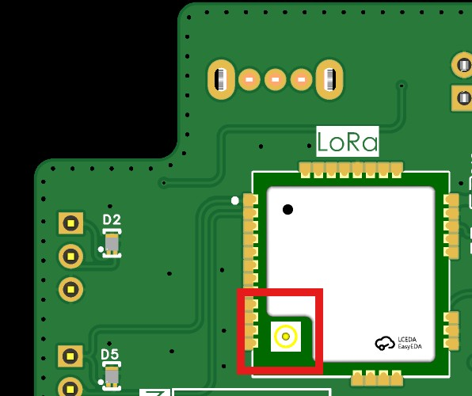
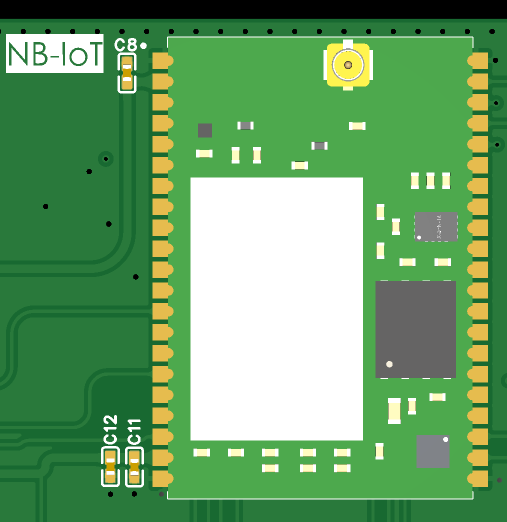

# 3. Comunicaciones

El ISURLOG incluye Wi-Fi y Bluetooth integrados. Además, puede llevar un módulo de comunicación LoRa o NB-IoT, ya que ambas opciones son mutuamente excluyentes.

## 3.1. LoRaWAN

El ISURLOG utiliza la tecnología LoRaWAN (derivada de LoRa, modulación de largo alcance) para la transmisión inalámbrica de datos a larga distancia. Opera en la banda de frecuencia libre de 868 MHz, estándar en Europa.

!!! note "Nota"
    868 MHz es la única configuración de fábrica disponible. Si se necesita una frecuencia regional distinta, contactar directamente con ISURKI.

### Requisitos de Conexión y Seguridad

Es **imprescindible** que la antena esté siempre conectada antes de encender el dispositivo, para evitar daños permanentes en el circuito de radiofrecuencia.

* La antena utilizada debe estar diseñada para **868 MHz**.
* Debe tener una **impedancia de 50 ohmios** y un ROE (VSWR) bajo para garantizar la máxima eficiencia.
* La placa del ISURLOG dispone de un **conector de antena tipo U.FL**.

{width="400"}

*El conector de antena U.FL, módulo LoRaWAN.*

## 3.2. NB-IoT (Narrowband IoT)

NB-IoT es una tecnología de comunicación inalámbrica diseñada específicamente para el Internet de las Cosas (IoT). Su enfoque de banda estrecha permite una conectividad eficiente en entornos urbanos y suburbanos, destacando por su capacidad de penetración en zonas de difícil acceso.

### Eficiencia Energética y Comunicación Bidireccional

Aunque NB-IoT ofrece velocidades de datos menores que las tecnologías de banda ancha, resulta ideal para aplicaciones IoT que no requieren transmisión en tiempo real, priorizando la **eficiencia energética** y **prolongar la vida de la batería**.

Gracias a la combinación de NB-IoT con el modo de ahorro de energía eDRX (recepción discontinua extendida), la versión NB del ISURLOG ofrece **comunicación bidireccional**. Esta característica clave permite al usuario "despertar" remotamente el datalogger en cualquier momento para forzar una lectura o cambiar parámetros, una operación que se gestiona desde la plataforma en la nube **IsurDASH**.

### Requisitos de Conexión y Seguridad

Es **imprescindible** conectar una antena LTE para evitar dañar el circuito de radiofrecuencia.

* El conector para la antena LTE del ISURLOG es de tipo **U.FL**.
* Gracias a su avanzada arquitectura de front-end de RF, este mismo conector y antena también dan servicio a la recepción **GPS** — una sola antena es suficiente para ambas funciones, sin necesidad de una antena o conector GPS independiente.

{width="600"}

*El conector de antena U.FL, módulo NB-IoT — compartido con el GPS, sin necesidad de antena adicional.*

### Flexibilidad en la Gestión de la SIM

El ISURLOG ofrece dos opciones flexibles para gestionar la suscripción NB-IoT:

* **eSIM integrada:** el dispositivo incorpora una SIM embebida (eSIM) soldada en la placa. Esta eSIM puede usarse con una tarifa de datos proporcionada por ISURKI (consultar términos y condiciones).
* **Nano-SIM externa:** los usuarios tienen la opción de utilizar su propia tarjeta Nano-SIM física, insertándola en la ranura correspondiente del ISURLOG. Esta SIM debe tener contratada una tarifa de datos compatible con NB-IoT con el operador que el usuario prefiera.

## 3.3. Wi-Fi y BLE

A diferencia de LoRaWAN y NB-IoT, que son módulos de radio externos y mutuamente excluyentes entre sí, **el Wi-Fi y el Bluetooth Low Energy (BLE) están integrados en el propio chip ESP32** — están presentes en **todos** los ISURLOG, independientemente de qué módulo de comunicación externo (si lo hay) esté instalado.

* **Wi-Fi:** 802.11 b/g/n, 2,4 GHz. Puede usarse como una vía alternativa para subir datos a la plataforma.
* **Bluetooth:** v4.2 (BR/EDR + BLE). Se usa para la conexión local en tiempo real descrita en **[1.8 Sensores Internos y Diagnóstico](sensor-connections.md#18-sensores-internos-y-diagnostico)** (configuración del dispositivo y visualización de sensores en vivo por Bluetooth) — disponible independientemente de qué módulo de comunicación externo esté instalado.

Ambas radios utilizan la **antena integrada directamente en la PCB** — no se requiere ninguna antena o conector externo para el Wi-Fi ni para el Bluetooth.
