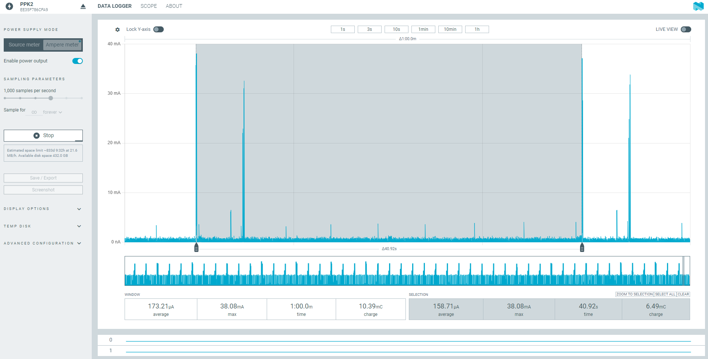
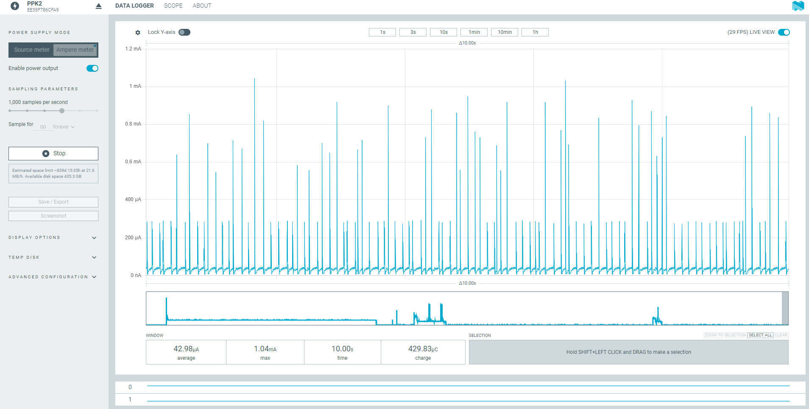

# 1. Gráficos de Consumo

Capturas reales de corriente frente a tiempo que muestran lo que cuesta realmente cada parte del ciclo de trabajo — un complemento a la [Calculadora de Consumo de Energía y Vida de la Batería](power-budget.md), basada en mediciones reales en vez de estimaciones. Esta página crece con el tiempo, a medida que hay nuevas capturas disponibles.

## 1.1 Método de Medición

**Equipo.** El consumo de corriente del ISURLOG abarca un rango muy amplio — desde unos 20µA en reposo profundo hasta más de 0,5A durante una ráfaga de transmisión — así que un multímetro normal no puede seguir con precisión ambos extremos de ese rango. Se necesita un medidor con **autorrango**. Las capturas de esta página usan el **Nordic Power Profiler Kit II (PPK2)**, con su aplicación **Power Profiler** para nRF Connect for Desktop, pero cualquier medidor de corriente con autorrango es válido — la elección se deja al lector.

**Cableado — el jumper I_SENSE.** Toda la corriente de la batería pasa por el jumper **I_SENSE** (ver [2.2. Configuración de Jumpers para los Modos de Alimentación](power-supply.md)). En funcionamiento normal permanece **cerrado** (en cortocircuito). Para medir el consumo:

1. Abrir/retirar el jumper I_SENSE.
2. Insertar el medidor en serie: el **pin interior** (pin 1 más abajo) es **VIN** (lado de la batería) — conectarlo al VIN del medidor. El **pin exterior** (pin 2) se conecta al VOUT del medidor.
3. Conectar el **GND** del medidor a un GND del ISURLOG — p. ej. en los pines de cabecera UART del ESP32 o del RAK3172.

{width="220"}

*Cableado del PPK2 en serie a través del jumper I_SENSE.*

**Condiciones.** Cada captura de abajo indica la versión de firmware, la conectividad, y la configuración de sensores bajo la que se tomó — las cifras reales varían según estos factores, así que trátalas como un punto de referencia, no como una hoja de especificaciones.

!!! note "General"
    Justo después de desconectar y volver a conectar la alimentación, la placa puede consumir alrededor de **23 µA por encima de los mínimos especificados** durante los primeros minutos. Esto lo causa el **fuel gauge MAX17048**, que todavía está ejecutando sus cálculos y calibración iniciales — no es un fallo, y no es representativo del consumo en régimen estable. Las capturas de esta página se toman bastante después de esa ventana inicial.

---

## 1.2 Capturas

### Reposo Profundo — NB-IoT/LTE-M

*Consumo de corriente en reposo profundo, NB-IoT, ventana de 3 segundos.*

Capturado con el PPK2 en modo amperímetro, 1000 muestras/segundo, en una ventana de 3 segundos:

* **Media:** 77,44 µA
* **Pico:** 1,22 mA (picos cortos periódicos visibles en la traza)
* **Ventana:** 3,001 s · **Carga:** 232,39 µC

!!! note "Qué incluye esta cifra"
    Este es el **sistema completo** en reposo, no solo el ESP32: el reposo profundo del ESP32 **más** el módem nRF9151, encendido y ya conectado a la red NB-IoT — sin reconexión pendiente cuando llega la próxima transmisión programada. Por eso es más alta que una cifra de reposo profundo del ESP32 solo; es el número más realista para una unidad desplegada en campo.

!!! note "Los picos periódicos"
    Los picos cortos y regulares que se ven sobre la línea base vienen del propio regulador de alimentación de la placa: con una carga muy ligera (como en reposo profundo), pasa a un modo de funcionamiento pulsado de bajo consumo — disparando pulsos breves de corriente para recargar su condensador de salida, en vez de conmutar de forma continua. El consumo aguas abajo se mantiene estable; los pulsos son comportamiento propio del regulador, no algo que hagan el ESP32 o el módem.

**Ventana más larga — ciclo de paging eDRX:**

*El mismo estado de reposo profundo, ampliado a una ventana de 1 minuto — picos de paging eDRX visibles.*

Al ampliar la ventana a 1 minuto se aprecia un segundo pico periódico, más grande (30-38 mA), sobre la línea base — son las **ocasiones de paging eDRX** del módem, en las que se despierta brevemente para escuchar la red. El intervalo entre dos ocasiones consecutivas es de **40,96 s en el firmware estándar**, coincidiendo con los **40,92 s** medidos aquí.

* **Media de la ventana:** 173,21 µA · **Máximo de la ventana:** 38,08 mA · **Carga de la ventana:** 10,39 mC (1 minuto)
* **Entre dos ocasiones de paging:** 158,71 µA de media · 40,92 s · 6,49 mC de carga

### Reposo Profundo — LoRaWAN

*Consumo de corriente en reposo profundo, LoRaWAN, ventana de 10 segundos.*

Capturado con el PPK2 en modo amperímetro, 1000 muestras/segundo, en una ventana de 10 segundos:

* **Media:** 42,98 µA
* **Pico:** 1,04 mA (picos cortos periódicos visibles en la traza)
* **Ventana:** 10,00 s · **Carga:** 429,83 µC

!!! note "Qué incluye esta cifra"
    Este es el **sistema completo** en reposo, no solo el ESP32: el reposo profundo del ESP32 **más** el módem RAK3172, encendido y ya unido a la red LoRaWAN, en su propio modo de reposo de bajo consumo. Más bajo que la cifra de NB-IoT de arriba — esperable, ya que el consumo en reposo de LoRaWAN es inherentemente más bajo que el de un módem celular.

!!! note "Los picos periódicos"
    Misma causa que en la captura de NB-IoT de arriba: el propio regulador de alimentación de la placa pasando a un modo de funcionamiento pulsado de bajo consumo con carga muy ligera, disparando pulsos breves de corriente para recargar su condensador de salida. No es algo que hagan el ESP32 o el módem.

!!! note "🚧 Próximamente"
    Reposo Profundo — Wi-Fi, Despertar + Lectura de Sensores, y una captura del ciclo de transmisión para cada opción de conectividad.
