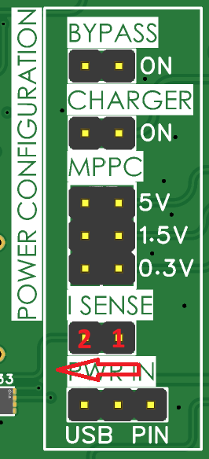
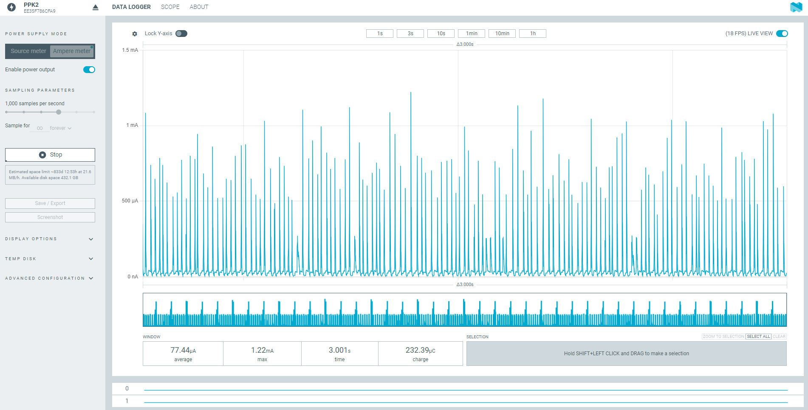

# Consumption Graphs

Real current-vs-time captures showing what each part of the duty cycle actually costs — a companion to the [Power Budget & Battery Life Calculator](power-budget.md), grounded in measurement instead of estimates. This page grows over time as new captures become available.

## 1. How We Measure

**Equipment.** ISURLOG's current draw spans a very wide range — roughly 20µA in deep sleep up to 0.5A+ during a transmit burst — so a regular multimeter can't track both ends of that swing accurately. You need a meter with **autoranging**. We use the **Nordic Power Profiler Kit II (PPK2)**, captured with its **Power Profiler** app for nRF Connect for Desktop, but any autoranging current meter works — the choice is yours.

**Wiring — the I_SENSE jumper.** All battery current passes through the **I_SENSE** jumper (see [3.2. Jumper Configuration for Power Modes](power-supply.md)). In normal operation it stays **closed** (shorted). To measure consumption:

1. Open/remove the I_SENSE jumper.
2. Insert the meter in series: the **inner pin** (pin 1 below) is **VIN** (battery side) — connect it to the meter's VIN. The **outer pin** (pin 2) connects to the meter's VOUT.
3. Tie the meter's **GND** to an ISURLOG GND — e.g. at the ESP32 or RAK3172 UART header pins.

{width="220"}

**Conditions.** Each capture below notes the firmware version, connectivity, and sensor configuration it was taken under — real numbers vary with these, so treat them as a reference point, not a spec sheet.

---

## 2. Captures

### Deep Sleep — NB-IoT/LTE-M

Captured with the PPK2 in Ampere meter mode, 1,000 samples/second, over a 3-second window:

* **Average:** 77.44 µA
* **Peak:** 1.22 mA (periodic short spikes visible in the trace)
* **Window:** 3.001 s · **Charge:** 232.39 µC

!!! note "Coming soon"
    Deep Sleep — LoRaWAN, Deep Sleep — Wi-Fi, Wake + Sensor Read, and a transmission-cycle capture for each connectivity option.
