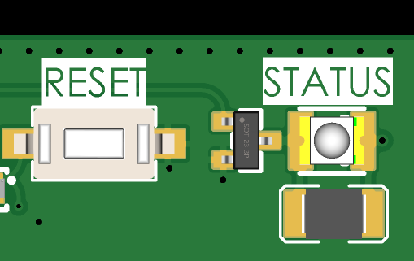

# 5. Datalogger Operation

The ISURLOG is an intelligent datalogger designed to operate autonomously for long periods in ultra-low power mode. Its core functionality revolves around the **Normal Logging Cycle** and a manual **Bluetooth Diagnostics Mode**.

## 5.1. Bluetooth Diagnostics Mode (Magnet Activated)

This mode allows field personnel to interact directly with the ISURLOG via a local connection.

### 1. Activation

By approaching and holding a magnet on the magnetic sensor zone (refer to **1. Sensor Connections** for details), the ISURLOG immediately wakes up and enters this special mode. The STATUS LED will begin to flash with a distinct pattern to indicate it is ready (refer to **5.3. Field Diagnostics (LED STATUS)**).

### 2. Connection Wait

The datalogger activates its Bluetooth and enters pairing mode, waiting for a mobile phone or tablet to connect via the IsurDASH application or web interface.
The ISURLOG will wait for a maximum of **2 minutes (120 seconds)** for a connection. If no client connects within this time, it will cancel the Bluetooth mode and continue with its normal logging cycle.

### 3. Live Data Session

Once a client connects, the datalogger enters a "live data" mode. In this state, the device:
* Performs **continuous readings** of all enabled sensors.
* **Sends this data in real-time** to the connected device (phone or tablet) via Bluetooth, allowing values to be viewed instantly.
* During this time, the user can also **send new configurations** to the datalogger from the application.

### 4. Termination

The Bluetooth session ends when the user disconnects from the application. At that moment, the ISURLOG exits Bluetooth mode and resumes its programmed normal logging cycle.

## 5.2. Normal Logging Cycle (Automatic Operation)

This is the standard, autonomous functioning mode of the ISURLOG.

### 1. Wake Up and Read

The **ISURLOG** automatically wakes up at the programmed time. The first task is to perform a full sensor reading cycle, powering on only the necessary components to read all sensors enabled in the configuration. It also measures its own battery voltage.

### 2. Alarm Check

Immediately after reading, the device checks if any of the measured values have exceeded the alarm thresholds configured by the user.

### 3. Package and Storage

All data collected in the cycle are packaged in a compact format and are securely stored in the device's **RAM memory**. The **ISURLOG** keeps a count of how many records have been accumulated.

### 4. Decision: Transmit or Sleep?

After storing the data, the **ISURLOG** decides whether to activate the modem to transmit the data to the cloud or whether it should return to sleep to continue accumulating records. This decision directly depends on the "**Logging Mode**" selected in the configuration:

* **Fixed Mode (Normal):** The device prioritizes energy saving and data grouping. Transmission occurs **only** when the number of records defined in the "**Record Accumulator**" is reached. Alarm conditions are recorded in the data but do not force an immediate send.
* **Conditional Mode:** The device prioritizes the notification of important events. Transmission occurs if **either** of the following conditions is met:
    1.  The number of records defined in the "**Record Accumulator**" has been reached.
    2.  A condition of alarm has been detected during the reading cycle.

In this mode, a critical alarm will **always** force a connection and an immediate data send, even if the accumulator is not full.

### 5. Return to Deep Sleep

After completing its task (whether only storing, or storing and transmitting), the **ISURLOG** turns off all non-essential components and enters an ultra-low-power deep sleep mode. It will remain in this state until the internal timer indicates it is time to wake up for the next cycle, or until it is manually activated by the magnet.

## 5.3. Field Diagnostics (LED STATUS)

The ISURLOG is equipped with an ultra-low-consumption green LED, identified on the PCB as "**STATUS**", which serves as a visual indicator to communicate the device's current status and activity.

This indicator is located in the upper right corner of the PCB, right next to the **RESET button**.

In ISURLOG models with a transparent cover, the LED is visible from the outside; however, in versions with an opaque cover, the lid must be opened to observe it. Due to its ultra-low consumption design to maximize battery life, the intensity of the LED is moderate, which may make it difficult to visualize under direct sunlight.

{width="400"}

*The STATUS LED, next to the RESET button.*

### LED Patterns and their Meanings

Observing the STATUS pattern is the fastest way to diagnose the datalogger's behavior in the field without establishing a connection.

| ISURLOG Status | STATUS LED Pattern |
| :--- | :--- |
| **Low Power Mode (Battery OK)** | One short flash every 10 seconds. |
| **Low Power Mode (Battery < 3600mV)** | One short and spaced flash every 20 seconds. |
| **Waking Up / Reading Sensors** | A short and frequent flash every 2 seconds. |
| **Initializing Connection (NB-IoT/LoRaWAN)** | A sequence of three rapid flashes. |
| **Transmitting Data (NB-IoT/LoRaWAN)** | One long light pulse during transmission. |
| **Bluetooth Mode (Waiting for Connection)** | A sequence of five rapid flashes. |
| **Bluetooth Mode (Client Connected)** | A sequence of three rapid flashes. |

!!! note "Note on Pulse Counter"
    When the digital input is configured in "pulse counter" mode, the LED indicator is automatically disabled. This is because both functions (the pulse counter and the LED flashing in low power mode) use the same internal microcontroller resource, and their simultaneous operation is incompatible.
