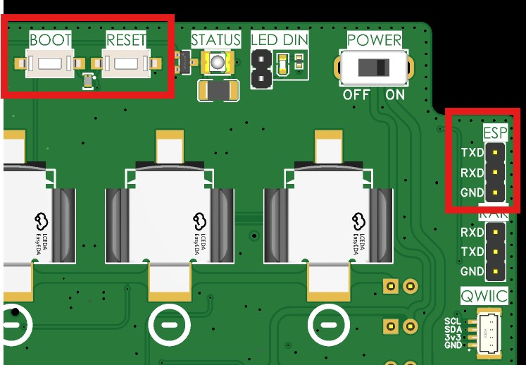

# 3. Flashing and Application Upload

This guide covers the two distinct steps required for setting up the ISURLOG development environment: first, flashing the MicroPython binary, and second, uploading the application logic.

!!! note "Just installing an official release, not developing firmware?"
    IsurDASH has a guided firmware update tool (**Serial port (USB)** method) that walks you through this same RST/BOOT sequence with a friendlier UI — see **6.8. Device Maintenance**. This page is for developers flashing a custom/locally-built `firmware.bin` that isn't a published release.

## 3.1 Required External Hardware

The ISURLOG board does **not** include an integrated USB-to-UART converter. Developers must use an **external UART TTL to USB converter** to communicate with and flash the ESP32.

### Key PCB Components

Identify the necessary buttons and the serial programming port (UART) on the **ISURLOG** PCB:

* **Buttons:** RESET and BOOT.
* **Programming Port:** The UART port, labeled "**ESP**".

{ width="740" }

## 3.2 Flashing the Firmware Core (firmware.bin)

This procedure puts the ESP32 into download mode to load the compiled `firmware.bin` file (Layer 1).

### Step 1: Connect Hardware

1.  Connect the external USB-UART converter to the "**ESP**" port pins on the **ISURLOG** PCB.
2.  Ensure you have the compiled `firmware.bin` file ready (from **1. Build Environment Setup**).

### Step 2: Enter Download Mode (BOOT)

To put the ESP32 into download mode:

1.  Press and hold the **RST** button.
2.  While holding **RST**, press and hold the **BOOT** button.
3.  Release the **RST** button.
4.  Release the **BOOT** button.

The serial monitor should display the message "**Waiting for download**", confirming the ESP32 is ready for firmware upload.

### Step 3: Use Flashing Tool (e.g., Thonny or esptool.py)

While the standard method uses `esptool.py`, the simplest way for MicroPython is often through an IDE interface (Thonny is shown here as an example):

1.  Open **Thonny**.
2.  Navigate to **Tools** > **Options** > **Interpreter**.
3.  Click "**Install or update MicroPython (esptool)**".
4.  Select the **port number** connected to the ISURLOG.
5.  Select the previously downloaded MicroPython binary and click "**Install**".
6.  Wait for the installation process to complete. The development environment provides detailed information about the operation.
7.  Once the process is complete, press the **RST** button or toggle the **ON/OFF** switch to restart the ISURLOG and boot into MicroPython.

## 3.3 Uploading Application Code (Layer 2)

After flashing the `firmware.bin`, you must upload the application logic files from the `/app` folder to the device's filesystem.

This process is simpler and **does not** require the BOOT/RESET sequence. Tools like **Thonny**, **rshell**, or standard MicroPython commands can be used to copy the contents of the `/app` folder (including `main.py`, configuration, and utility files) onto the live filesystem of the ISURLOG via the USB-UART converter.

!!! note "Tip"
    Ensure the **ISURLOG** is running in its normal operating mode (ON/OFF switch is ON) when uploading the application code via Thonny's filesystem view.
