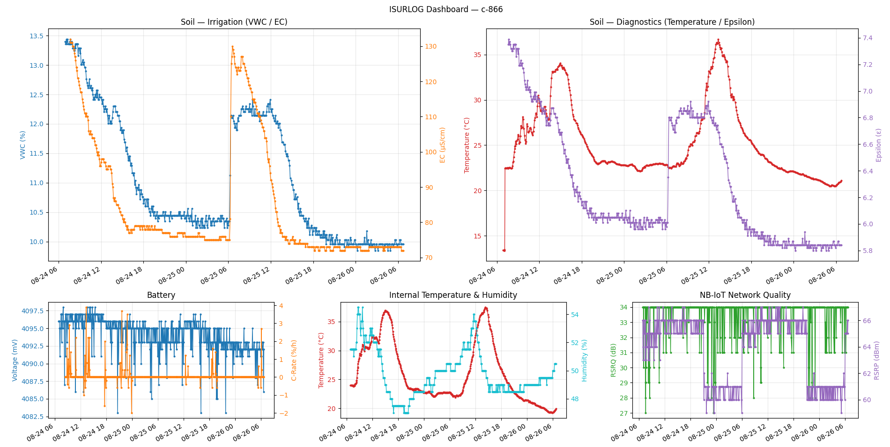

# 2. Historical Data via InfluxDB API (Pull Method)

## 2.1 Overview

All historical data from Isurlog devices is stored in **InfluxDB**, a high-performance, open-source time-series database. It is specifically designed to handle large volumes of timestamped data, making it ideal for IoT and monitoring applications.

Data accessed via this method is **fully decoded** and available in a human-readable format, ready for direct integration into SCADA systems, BI tools, or custom applications **without the need for payload decoding**.

## 2.2 Client Libraries & Documentation

InfluxDB provides a wide range of officially supported client libraries for popular programming languages, including Python, JavaScript, Java, Go, and C#, which simplifies data interaction.

* The complete official documentation for the InfluxDB v2 API and these client libraries can be found at the following URL:
    * [https://docs.influxdata.com/influxdb/v2/api-guide/client-libraries/](https://docs.influxdata.com/influxdb/v2/api-guide/client-libraries/)

## 2.3 Connection Parameters

The following parameters are required to establish a secure connection to the Isurlog InfluxDB instance:

* **Endpoint URL:** `https://influxisurdash.isurki.com`
* **Organization:** `isurki`
* **Bucket:** A unique bucket name will be provided for each client (e.g., `Isurlog_ClientName`). This bucket contains data exclusively from that client's registered Isurlog devices.
* **API Token:** A unique, private API token will be provided to each client for secure access. This token must be included in the authorization header of all API requests. Please contact our support team to receive your token.
* **Device Tag:** Every point is tagged with **`isurlog_id`** (the device's ID, e.g. `c-123`) — use it to filter by device in your own Flux queries.

## 2.4 Data Schema: Field Key Reference

This section provides the mapping between the physical and virtual inputs of the Isurlog datalogger and the corresponding `_field` keys used in the InfluxDB database. The value associated with each field key represents the final **processed and scaled measurement** from the sensor, ready for use in engineering units.

!!! note "Note"
    For analog, digital, and Modbus inputs, the final value and its engineering unit (e.g., m³, bar, pH) are determined by the scaling and configuration applied in the IsurDASH application. The value stored in the database is the final, scaled result.

| Isurlog Input | InfluxDB `_field` Key | Description |
| :--- | :--- | :--- |
| **Analog Input 0** | `AnalogInput0` | The measurement in engineering units as configured in IsurDASH. |
| **Analog Input 1** | `AnalogInput1` | The measurement in engineering units as configured in IsurDASH. |
| **Analog Input 2** | `AnalogInput2` | The measurement in engineering units as configured in IsurDASH. |
| **Analog Input 3** | `AnalogInput3` | The measurement in engineering units as configured in IsurDASH. |
| **Digital Input 0** | `DigitalInput0` | Depends on IsurDASH configuration: a numeric value for pulse counting or a binary state (0 for open, 1 for closed). |
| **Modbus Virtual 0** | `ModbusInput0` | The measurement in engineering units as configured in IsurDASH. |
| **Modbus Virtual 1** | `ModbusInput1` | The measurement in engineering units as configured in IsurDASH. |
| **Modbus Virtual 2** | `ModbusInput2` | The measurement in engineering units as configured in IsurDASH. |
| **Modbus Virtual 3** | `ModbusInput3` | The measurement in engineering units as configured in IsurDASH. |
| **PT100 Input** | `TemperatureInput0` | Temperature measurement from the external PT100 sensor in degrees Celsius (°C). |
| **Internal Temperature** | `TemperatureSensor0` | Temperature from the sensor embedded on the ISURLOG's own PCB, in degrees Celsius (°C). |
| **External Temperature** | `TemperatureSensor1` | Temperature from an external sensor connected via the **QWIIC (I2C)** port, in degrees Celsius (°C). Only present if that sensor is connected. |
| **Internal Humidity** | `HumiditySensor0` | Relative humidity from the sensor embedded on the ISURLOG's own PCB (%). |
| **External Humidity** | `HumiditySensor1` | Relative humidity from an external sensor connected via the **QWIIC (I2C)** port (%). Only present if that sensor is connected. |
| **Accelerometer X-axis** | `AccelerometerX0` | Acceleration on the X axis (g). |
| **Accelerometer Y-axis** | `AccelerometerY0` | Acceleration on the Y axis (g). |
| **Accelerometer Z-axis** | `AccelerometerZ0` | Acceleration on the Z axis (g). |
| **Battery Voltage** | `VoltageInput0` | The device's battery voltage in millivolts (mV). |
| **Battery C-Rate** | `CRateInput0` | The battery's charge/discharge rate, in %/h. |
| **Modem Signal Quality** | `ModemData0` | RSRQ (Reference Signal Received Quality) reported by the modem, in **dB**. **NB-IoT devices only** — not available on LoRaWAN devices. |
| **Modem Signal Strength** | `ModemData1` | RSRP (Reference Signal Received Power) reported by the modem, in **dBm**. **NB-IoT devices only** — not available on LoRaWAN devices. |

## 2.5 Reference Implementation

A complete Python script demonstrating how to connect to the InfluxDB API, query historical values for a device, print them as a table, and chart the results is provided in the accompanying file: **[isurlog_influx_demo.py](https://github.com/isurki-tecnica/isurlog-firmware/blob/main/data_integration/isurlog_influx_demo.py)**.

### Try It Instantly — No Credentials Needed

The script's connection parameters are pre-filled with a **public, read-only demo** so you can run it immediately, before contacting support for your own token:

* **Bucket:** `Isurlog_DEMO`
* **Device (`isurlog_id`):** `c-866`
* **Access:** read-only, scoped to this bucket only — it cannot read any other client's data.

This demo device reports: accelerometer (X/Y/Z), internal temperature and humidity, battery voltage, battery C-rate, NB-IoT signal quality (RSRQ/RSRP), and — via a Modbus soil probe (S-Soil MTEC-02B) wired to it — soil temperature, moisture (VWC), electrical conductivity (EC), and raw dielectric permittivity (Epsilon), so it exercises most of the field keys in the table above.

To run it, from inside `data_integration/`, using a virtual environment (standard practice, and required on newer Debian/Ubuntu-based systems such as WSL, which block system-wide `pip install`):

```bash
python3 -m venv venv
source venv/bin/activate
pip install -r requirements.txt
python isurlog_influx_demo.py
```

When you're done:

```bash
deactivate
```

This prints a table of the last 7 days of readings and opens a **single window with a dashboard** (via `matplotlib`), instead of one pop-up per chart. The layout is two rows — the soil probe readings on top, larger, since they're the main point of this demo; the device's own housekeeping metrics below, smaller:

{width="800"}

*The reference script's dashboard — soil probe readings on top, device housekeeping metrics below.*

1. **Soil — Irrigation** *(large)* — moisture (`ModbusInput1`/VWC, left axis, %) vs. electrical conductivity (`ModbusInput2`/EC, right axis, µS/cm).
2. **Soil — Diagnostics** *(large)* — soil temperature (`ModbusInput0`, left axis, °C) vs. raw dielectric permittivity (`ModbusInput3`/Epsilon, right axis — dimensionless, it's a ratio of two permittivities so it has no unit).
3. **Battery** *(small)* — voltage (`VoltageInput0`, left axis) vs. C-rate (`CRateInput0`, right axis).
4. **Internal Temperature & Humidity** *(small)* — `TemperatureSensor0` (left axis) vs. `HumiditySensor0` (right axis).
5. **NB-IoT Network Quality** *(small)* — RSRQ in dB (`ModemData0`, left axis) vs. RSRP in dBm (`ModemData1`, right axis).

Each chart plots two fields with independent Y-axes (left/right), since they're normally on very different scales. The underlying `_plot_dual_axis()` helper can be reused to build additional charts for any other `_field` key from **[2.4 Data Schema: Field Key Reference](#24-data-schema-field-key-reference)**. The uneven panel sizes are built with `matplotlib`'s `GridSpec` (rather than a uniform `plt.subplots()` grid) so the two large panels can each span what would otherwise be 1.5 columns of a plain 3-column layout.

To query your **own** devices, replace `URL`, `TOKEN`, and `BUCKET` at the top of the script with the private credentials Isurki provides you (see **[2.3 Connection Parameters](#23-connection-parameters)**).
