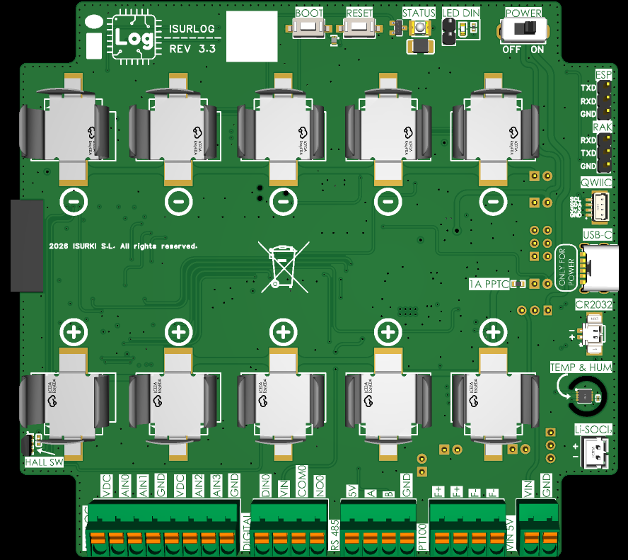

# ISURLOG: Industrial IoT Datalogger (Open Source)

The ISURLOG datalogger is a highly versatile **ESP32-based** device that integrates multiple functionalities for data acquisition and logging in diverse environments. It is a complete and efficient solution for monitoring industrial signals (4-20mA, Modbus RS485, PT100) with advanced connectivity (NB-IoT/LoRaWAN, Wi-Fi, and Bluetooth).
This datalogger runs on an **optimized MicroPython firmware** for low power consumption (20µA in sleep mode), making it ideal for battery-powered applications.

{width="884" height="780"}

## Where to begin

| 🛠️ Use and Hardware | 💻 Firmware Development | ☁️ Data Integration & APIs |
| :--- | :--- | :--- |
| Installation, sensor setup, and IsurDASH. | Build environment, architecture, contributing. | Historical/real-time data access, downlink API. |
| **Start here:** [2. Sensor Connections](sensor-connections.md) | **Start here:** [1. Build Environment Setup](build-environment.md) | **Start here:** [9. Data Access Overview](data-access-overview.md) |

Running into a problem in the field? See [Troubleshooting](troubleshooting.md). Want to estimate battery life? Try the interactive [Power Budget calculator](power-budget.md).

## Quick Resources

* **GitHub Repository:** [isurki-tecnica/isurlog-firmware](https://github.com/isurki-tecnica/isurlog-firmware)
* **Firmware Releases:** [Releases page](https://github.com/isurki-tecnica/isurlog-firmware/releases)
* **IsurDASH Cloud Platform Login:** [https://isurdash.isurki.com/login](https://isurdash.isurki.com/login)
* **Technical Support:** (+34) 943-635437 or tecnica@isurki.com.
