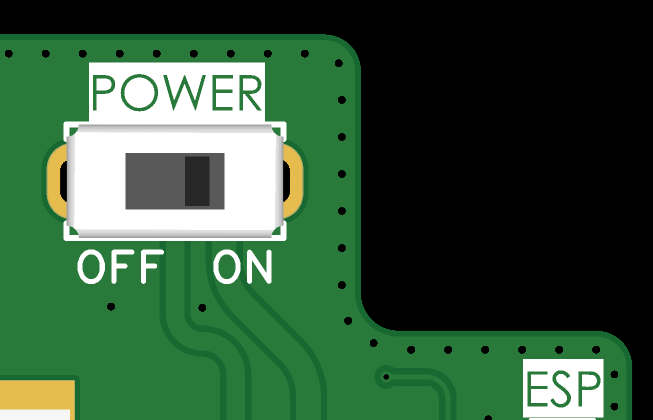

# 4. Installation and Commissioning

This section covers the physical installation, safety warnings, and the final power-up sequence for the ISURLOG datalogger.

## 4.1. Safety Warnings (Lithium Batteries)

The ISURLOG is powered by lithium batteries. Manipulation, installation, and disposal must adhere to current European standards (Directive 2006/66/CE, Regulation (EU) 2019/1020).

!!! warning "Key Safety Instructions"
    * **Battery Type:** Use only the battery type and model specified by the manufacturer.
    * **Mixing:** Do not mix new and used batteries, or combine batteries of different capacity, type, or manufacturer.
    * **Polarity:** Always respect the correct polarity (+/-) indicated in the battery compartment. Incorrect polarity can cause short circuits or overheating.
    * **Damage:** Insert batteries gently to avoid damaging the insulating sleeve. Do not puncture or deform the batteries.
    * **Exposure:** Avoid exposing the device or batteries to heat sources above 60 °C, humidity, or liquids.
    * **Storage:** If the product will not be used for a prolonged period, remove the batteries.
    * **Disposal:** Do not dispose of batteries with household waste. Deposit them at authorized selective collection points (ISURKI is a member of ERP, certificate n° 4598).

## 4.2. Physical Mounting

The ISURLOG's IP66 enclosure offers two methods for wall fixation.

### Standard Mounting

This method uses the four mounting holes provided inside the enclosure.

* **Procedure:** The front cover must be opened to access the anchor points.
* **Hole Distance (Center-to-Center):** 125 mm x 125 mm (square pattern — width and height are the same).

### External Mounting Accessories (Optional)

Two accessories allow mounting and dismounting the ISURLOG without ever opening the IP66 enclosure, for simpler installation and maintenance:

1. **DIN rail mount** — attaches the ISURLOG to a DIN rail. Two variants are available:
    * Direct mounting onto a **standard DIN rail**.
    * Mounting onto a separate **3D-printed plastic piece**, which is fixed to the wall first, and the ISURLOG then clips onto it.
2. **Pole mount** — attaches the ISURLOG to a post or pole.

* **3D Model Link:** 🚧 Coming soon.

## 4.3. Battery Removal and Insertion

For safety and to prevent damage to the batteries or the datalogger, follow these instructions:

### Removal Process

1.  **Power Off:** Turn off the ISURLOG using the **ON/OFF** switch. Disconnect any external power source (USB-C or PIN terminals) before switching off.
2.  **Lift Negative Pole:** Gently lift the battery's negative pole first.
3.  **Slide:** Slide the battery towards the negative pole.
4.  **Remove:** The battery can now be removed.

### Insertion Process

1.  **Power Off:** Ensure the ISURLOG is off and any external power is disconnected.
2.  **Insert Positive Pole:** Insert the battery's positive pole first.
3.  **Push:** Push the battery towards the positive pole.
4.  **Insert Negative Pole:** Finally, insert the negative pole.

## 4.4. Power-Up Sequence

Once the power system (batteries or external source) is correctly configured (refer to **[2. Power Supply Methods](power-supply.md)**) and external sensors are connected, the device is ready for initial activation.

### Step 1: Verify Antenna Connection

Before switching on, it is crucial to verify that the communication antenna (LoRaWAN or NB-IoT) is correctly connected to the U.FL socket on the PCB to ensure reliable data transmission and prevent damage to the RF circuit.

### Step 2: Locate the Switch

Locate the **ON/OFF** switch on the PCB.

{width="400"}

*The ON/OFF switch.*

### Step 3: Power On

Move the switch from the initial **OFF** position (left) to the **ON** position (right).

### Step 4: Initial Activation Confirmation

A few seconds after activation, the device's **STATUS LED** will begin to flash, indicating that the startup sequence has begun. Refer to [5. Datalogger Operation](datalogger-operation.md) for interpreting the LED patterns.

---
