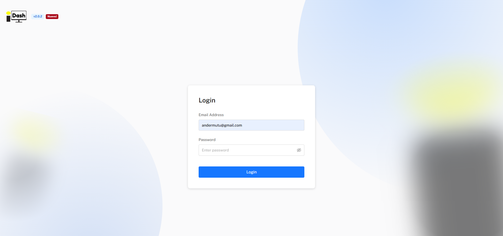

*Part of [6. IsurDASH Platform](isurdash-platform.md).*

# 6.1. First Steps: Access and Login

Access to the IsurDASH platform is done through a standard web browser. The sign-up process is initiated via an email invitation to guarantee account security.

## Account Creation Process

1.  **Account Creation:** To gain access, the user must first provide a valid email address to the Isurki team. An email containing an invitation link to the platform will be sent to this address.
2.  **Establish Password:** The user must click the link received in the invitation email. They will be redirected to a secure IsurDASH page where they can establish their personal password.
3.  **Login:** Once the password is set, the user can access the platform at any time from the following address:

    * **Login URL:** [https://isurdash.isurki.com/login](https://isurdash.isurki.com/login)

    Login is a two-step process: enter your email address first and press **Login**, then enter your password on the screen that follows and press **Login** again.

{width="700"}

*The IsurDASH login screen.*

!!! note "Note"
    The "**Forgot password?**" option is not shown on the initial login form — it only appears after an incorrect password attempt. From there it can be used to recover access. For any other access issues, contact the Isurki support team.
