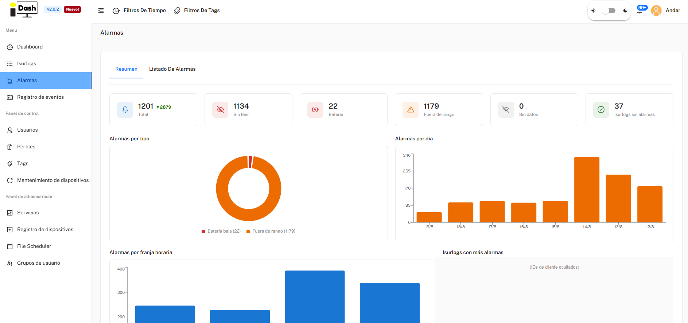
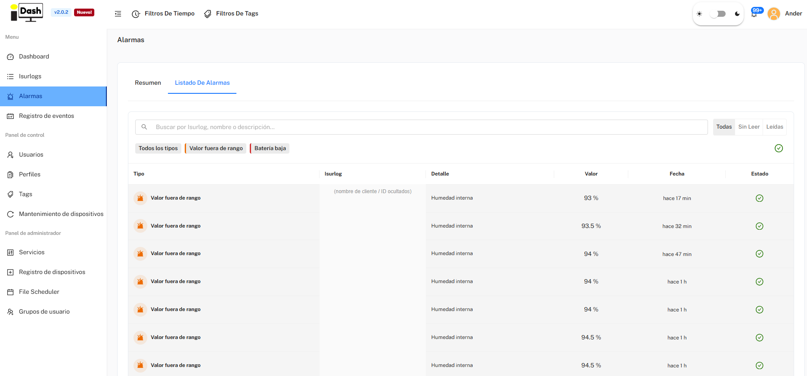

*Part of [6. IsurDASH Platform](isurdash-platform.md).*

# 6.4. Alarms

This section provides a complete and detailed historical record of all alarm events generated by the fleet of **ISURLOG** devices. Unlike the Dashboard's alarm panel, which only shows the most recent/unread events, here the user can consult, filter, and analyze the entire alarm history. It has two tabs: **Resumen** and **Listado De Alarmas**.

## Resumen

An analytics view of alarms across the whole fleet:

* Totals: **Total**, **Sin leer**, **Batería** (low-battery alarms), **Fuera de rango** (out-of-range value alarms), **Sin datos**, and **Isurlogs sin alarmas**.
* **Alarmas por tipo:** a breakdown chart by alarm type (low battery vs. out-of-range).
* **Alarmas por día** and **Alarmas por franja horaria:** when alarms have been happening, by day and by time of day.
* **Isurlogs con más alarmas:** a ranking of which devices have generated the most alarms.

{width="1000"}

## Listado De Alarmas

A searchable, filterable table listing each alarm event individually:

| Column | Description |
| :--- | :--- |
| **Tipo** | The nature of the alarm (e.g., "Valor fuera de rango," "Batería baja"). |
| **Isurlog** | The device name and ID that generated the alarm. |
| **Detalle** | The sensor or measurement that triggered the alarm (e.g., "Humedad interna"). |
| **Valor** | The exact value that was measured and triggered the alarm. |
| **Fecha** | When the ISURLOG recorded and transmitted the alarm event. |
| **Estado** | Whether the alarm has been read. |

A search box (by Isurlog, name, or description), a type filter (**Todos los tipos** / **Valor fuera de rango** / **Batería baja**), and a read-status filter (**Todas** / **Sin Leer** / **Leídas**) let you narrow down the list. Columns are sortable.

{width="1000"}
