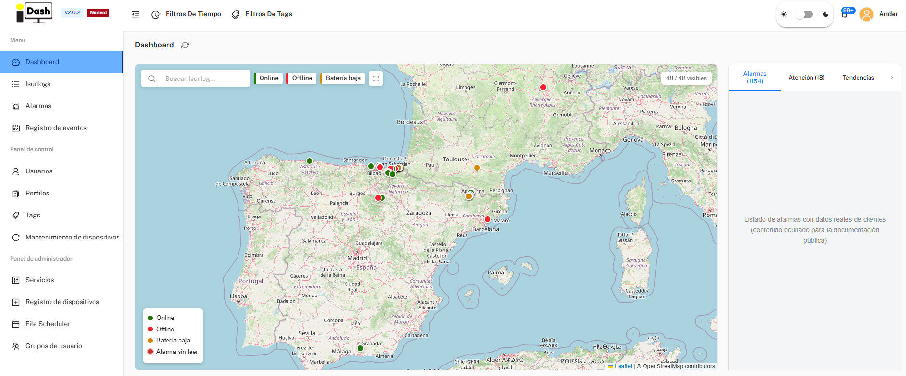
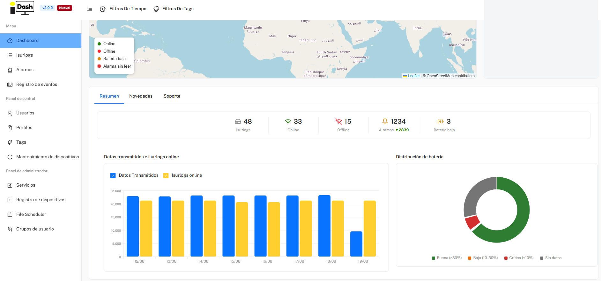

*Parte de [6. Plataforma IsurDASH](isurdash-platform.md).*

# 6.2. Panel Principal de Control (Dashboard)

El Dashboard es la pantalla principal a la que se dirige al usuario tras iniciar sesión. Su objetivo es ofrecer una visión rápida y global del estado completo de la flota de dispositivos **ISURLOG**.

La página se organiza en dos áreas principales:

## Mapa de la Flota y Panel de Alarmas

En la parte superior, un mapa interactivo muestra la ubicación geográfica de todos los **ISURLOG** de la flota, con un código de color según su estado (En línea, Fuera de línea, Batería baja, Alarma sin leer). Un cuadro de búsqueda y filtros de estado permiten acotar qué dispositivos se muestran en el mapa.

Junto al mapa, un panel con tres pestañas da acceso rápido a lo que requiere atención:

* **Alarmas:** alarmas sin leer y leídas recientemente en toda la flota, con el dispositivo afectado y una breve descripción de cada evento. Desde aquí también se pueden ver los detalles de una alarma y marcarla como leída.
* **Atención:** Isurlogs que necesitan atención urgente — dispositivos que no están transmitiendo, o que dejarán de transmitir pronto por batería baja.
* **Tendencias:** tendencias de alarmas de la flota: alarmas comparadas con el periodo anterior de igual duración, alarmas desglosadas por tipo (batería baja frente a valores fuera de rango), qué Isurlogs han generado más alarmas, y la evolución de las alarmas día a día.

{width="1000"}

*El mapa de la flota y el panel de alarmas.*

## Resumen y Gráficos de la Flota

Debajo del mapa, tres pestañas dan acceso a distinta información: **Resumen**, **Novedades** y **Soporte**.

La pestaña **Resumen** muestra un resumen instantáneo del estado de la flota:

* **Isurlogs:** número total de dataloggers registrados en la cuenta.
* **Online / Offline:** cuántos dispositivos han/no han transmitido recientemente.
* **Alarmas:** número total de eventos de alarma registrados por los dispositivos.
* **Batería baja:** número de dispositivos que actualmente reportan batería baja.

Debajo del resumen numérico, se muestran dos gráficos:

* **Datos transmitidos e isurlogs online:** un gráfico de barras con la actividad diaria de la flota — puntos de datos transmitidos y dispositivos en línea, día a día.
* **Distribución de batería:** un gráfico de anillo (donut) que desglosa la flota según el estado de la batería (Buena / Baja / Crítica / Sin datos).

{width="1000"}

*La pestaña Resumen — números y gráficos de la flota.*

La pestaña **Novedades** enumera las novedades de IsurDASH, versión a versión.
