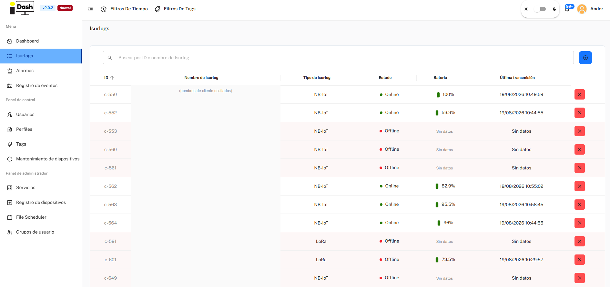
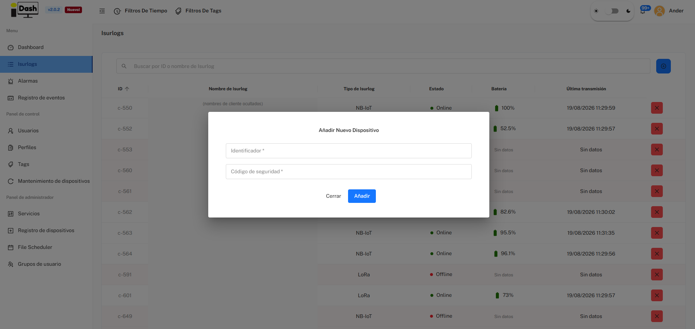
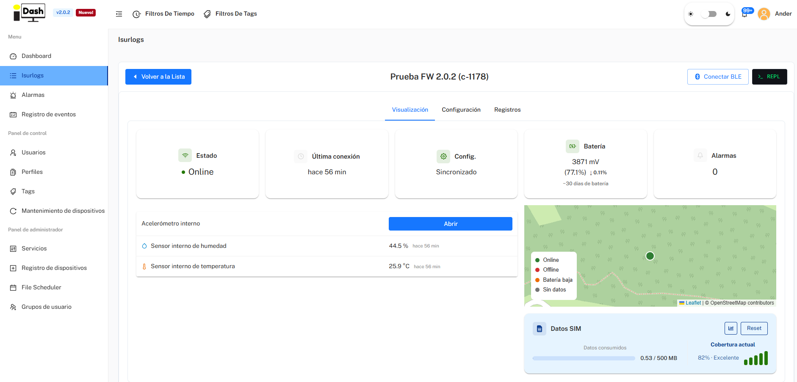
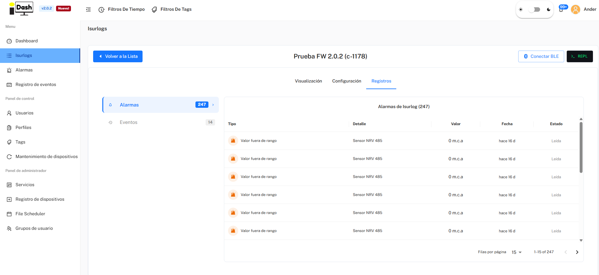
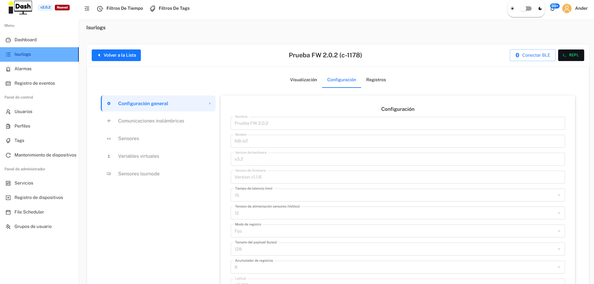
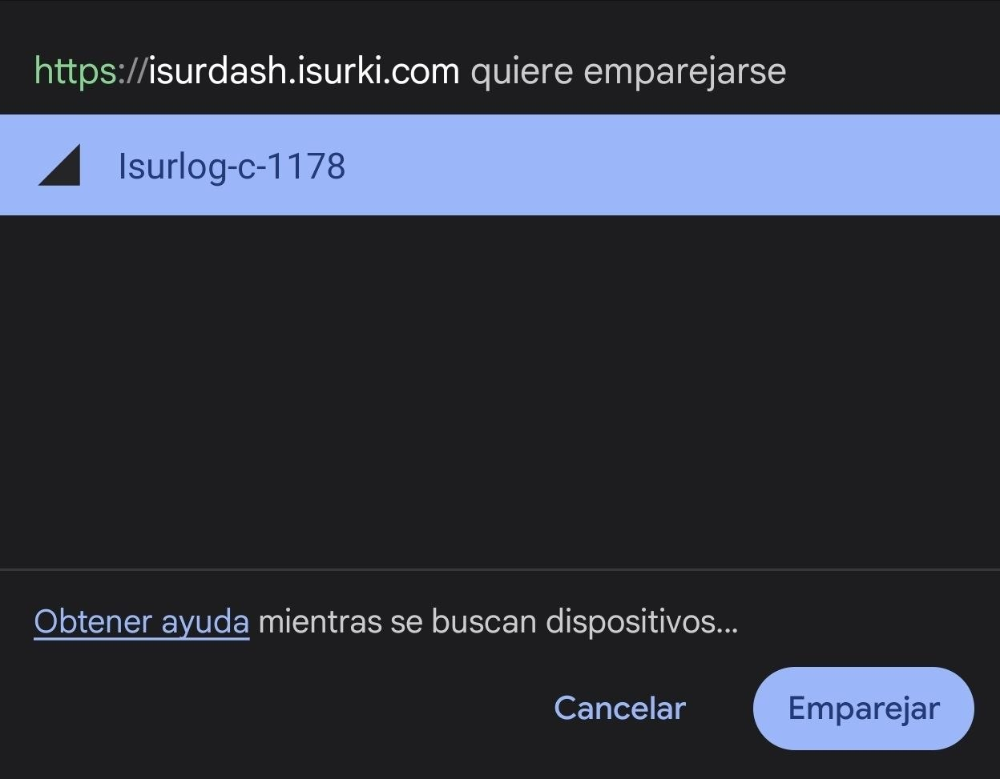
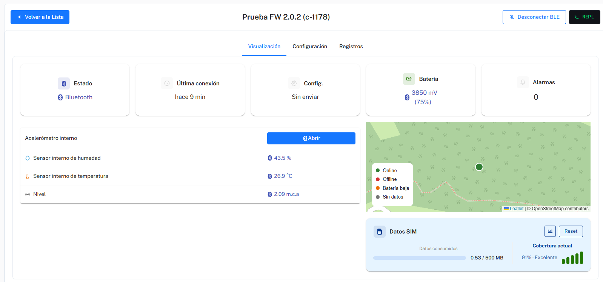
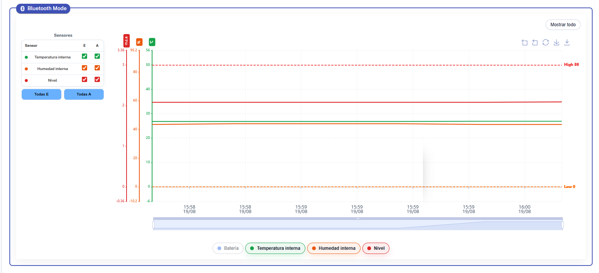

*Part of [6. IsurDASH Platform](isurdash-platform.md).*

# 6.3. Devices

This section serves as the control center for all ISURLOGs registered in the account. It allows users to obtain both a general overview of the fleet and to access detailed information and configuration settings for each device individually.

## 6.3.1. Device List

By selecting the "**Isurlogs**" menu, a table listing all the dataloggers in the fleet is presented, with a search box to filter by ID or name. This view shows: ID, Name, Type (NB-IoT/LoRa), Status (Online/Offline), Battery, and Last transmission.

To access a specific **ISURLOG**, the user must click on the corresponding row in the table.

{width="1000"}

*The Isurlogs list.*

## 6.3.2. Adding a New Device

To register a new **ISURLOG** datalogger on the platform, the user must follow these steps:

1.  **Start Registration:** Navigate to the "**Isurlogs**" screen and click on the blue button with the add symbol (**+**), located in the upper right corner.
2.  **Fill Form:** A dialog will open ("Añadir Nuevo Dispositivo") where two key pieces of data must be entered to associate the device with the account:
    * **Identificador:** The device's serial number. It must be entered in the format **c-XXX** (e.g., c-567).
    * **Código de seguridad:** A unique validation code to ensure that only the equipment owner can register it. This code is no longer printed on the PCB — it's found **inside the datalogger's enclosure**, next to the serial number, as a **QR code** to scan.

{width="1000"}

*The Añadir Nuevo Dispositivo dialog.*

## 6.3.3. Device Visualization and Status

Upon selecting a device, the user accesses its dedicated page, with the device's name and ID as the page title and quick-access buttons for **Conectar BLE** (see [6.3.5](#635-local-bluetooth-connection)) and **REPL** (opens a MicroPython console over **Remoto** or **Serial port (USB)** — see [6.8. Device Maintenance](isurdash-maintenance.md) for details; note this is never available over Bluetooth). The page has three tabs: **Visualización**, **Configuración** (see [6.3.4](#634-configuration-tab)), and **Registros**.

### Status Panel (Quick Overview)

At the top of the Visualización tab, a set of indicators offers a quick view of the device's current status:

* **Estado:** Online/Offline — whether the device is communicating correctly.
* **Última conexión:** how long ago the device last connected.
* **Config.:** whether the latest configuration changes saved on the platform have already been applied to the ISURLOG ("Sincronizado") or are pending the device's next connection.
* **Batería:** battery level in millivolts (mV) and estimated percentage (%), plus an estimated number of days of battery life remaining.
* **Alarmas:** number of active or recent alarms for that device.

### Data Visualization, Location and SIM Data

Just below the status panel:

* A table with the **most recent reading** of each of the connected sensors.
* A map indicating the **last known location** of the device.
* A **Datos SIM** card showing data consumed against the SIM's plan (e.g. "0.53 / 500 MB") and the current coverage quality — cellular coverage for NB-IoT/LTE-M devices, or coverage with the gateway for LoRa devices.

{width="1000"}

*Device status, latest sensor readings, location, and SIM data.*

Below that, an interactive chart area lets you analyze the evolution of sensor data and battery over time, with four views: **Gráfico principal** (time series per sensor), **Bubble chart**, **HeatMap de alarmas**, and **Tabla resumen**.

### Registros (Alarms and Events)

The **Registros** tab has two sub-sections:

* **Alarmas:** a list of all alarm events generated by this specific **ISURLOG** (type, detail, value, date, read/unread status).
* **Eventos:** an activity log for the device itself — configuration changes, sensors added/removed, REPL connections, manual battery changes, etc. — with a **"Registrar evento manual"** button to log something by hand (e.g. a battery replacement during a field visit).

{width="1000"}

*The Registros tab — Alarmas sub-section.*

## 6.3.4. Configuration Tab

The **Configuración** tab is organized as a left-hand sub-menu with five categories: **Configuración general**, **Comunicaciones inalámbricas**, **Sensores**, **Variables virtuales**, and **Sensores Isurnode**.

### Configuración general

Shows the ISURLOG's general parameters: name, modem type, hardware/firmware version, reading and transmission intervals, logging mode, payload size, GPS coordinates, RTC sync, vandalism alarm, assigned Tags, and the option to apply a saved Profile. At the bottom:

* **"Editar" Button:** toggles the fields into an editable state to make changes.
* **"Despertar Isurlog" Button:** sends a command to wake the datalogger from its low-power mode and force an immediate reading and transmission cycle. Only available for **ISURLOG** versions with **NB-IoT** technology, thanks to eDRX (extended Discontinuous Reception).

{width="1000"}

*The Configuración general screen.*

!!! note "Reference"
    For the meaning and impact of every individual parameter, see [7. Reference Configuration Parameters](reference-parameters.md) — this page intentionally doesn't screenshot every field; that reference is kept up to date instead.

### Comunicaciones inalámbricas

Shows the connectivity parameters for this ISURLOG: MQTT broker (server, port, user, password, topic), and modem-specific settings — APN and SIM preference for NB-IoT/LTE-M devices, or the equivalent LoRaWAN parameters for LoRa devices.

!!! warning "Important"
    this section can only be edited **locally, over the Bluetooth connection** (see [6.3.5](#635-local-bluetooth-connection)) — it cannot be changed remotely, unlike the rest of the configuration.

### Sensores

Lists all sensors (built-in and external: digital, analog, Modbus inputs, etc.) configured for this particular **ISURLOG**. From here you can add a new sensor, edit an existing one's configuration (including its alarm thresholds), or delete one that's no longer in use.

### Variables virtuales (Calculated Metrics)

The platform allows users to create **virtual variables** in addition to the list of physical sensors. Virtual variables are metrics that the ISURLOG does not read directly; rather, they are obtained by applying a **mathematical formula** to the data from the physical sensors (digital, analog, Modbus, etc.) already configured. This enables users to calculate complex metrics, such as **flow rate based on level**, or **flow rate based on level and velocity**, directly within the platform.

### Sensores Isurnode

Lists the sensors/outputs connected via an Isurnode expansion unit, when one is paired with this ISURLOG.

## 6.3.5. Local Bluetooth Connection

In addition to standard NB-IoT or LoRaWAN communication, the ISURLOG features a local **Bluetooth Low Energy (BLE)** connection mode. This functionality is extremely useful for tasks such as installation, maintenance, or sensor calibration, as it allows for continuous, real-time interaction with the device.

When a Bluetooth connection is established:
* The graphs on the Visualization tab are updated every few seconds.
* Changes made in the Configuration tab are applied instantly.
* **Important:** Data transmitted in this mode is for real-time visualization only and is **not recorded** in the IsurDASH platform history.

The process to establish a local Bluetooth connection requires coordinated action between the platform and the physical device:

### Step 1: Activate Bluetooth Mode on the ISURLOG

For the ISURLOG to be visible and connectable, the user must activate it manually with a magnet:
1.  The user must locate the magnetic sensor zone on the device's casing (refer to **1. Sensor Connections: Hall Effect Switch** for the exact location).
2.  A magnet must be held over that area continuously for at least **5 seconds**.
3.  The ISURLOG will activate Bluetooth and enter pairing mode. The user can confirm that the mode has been correctly activated by observing the specific pattern of the **STATUS LED** (refer to **5. Datalogger Operation: Field Diagnostics**).

### Step 2: Initiate the Connection in IsurDASH

1.  From the "**Visualización**" page of the desired device, the user must click the "**Conectar BLE**" button, located in the upper right corner.
2.  IsurDASH will begin scanning for the ISURLOG with the corresponding serial number.
3.  Once found, the browser's own Bluetooth pairing prompt appears (e.g. "Isurlog-c-1178"); the user must click "**Emparejar**" to establish the connection.

{width="500"}

*The browser's own Bluetooth pairing prompt.*

### Step 3: Real-Time Session and Disconnection

Once connected, the **Estado** indicator switches to "**Bluetooth**".

{width="1000"}

*Connected over Bluetooth — the Estado indicator switches to "Bluetooth".*

Below, the chart area (now labeled **"Bluetooth Mode"**) plots the connected sensors updating every few seconds, with each sensor's high/low alarm thresholds drawn as reference lines. The user can make changes in the Configuration tab and see their effect immediately.

{width="1000"}

*Real-time sensor chart in Bluetooth Mode, updating every few seconds.*

To end the session, the user must click the "**Desconectar BLE**" button, which appears in the same place as the connect button. Upon disconnection, the ISURLOG turns off its Bluetooth radio and returns to its programmed normal operating cycle.
