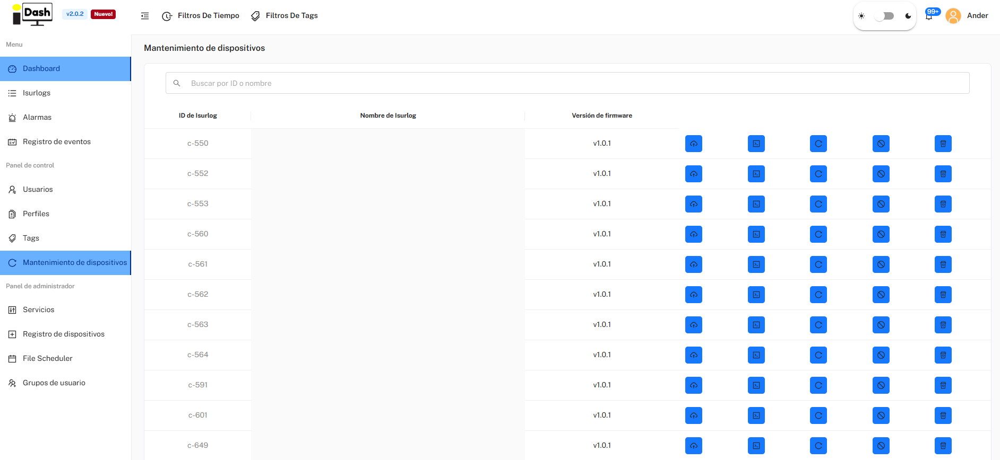
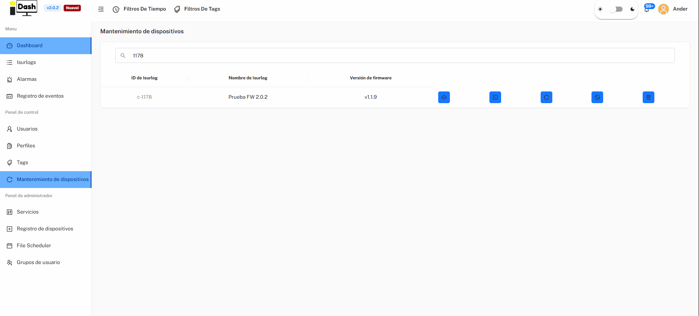
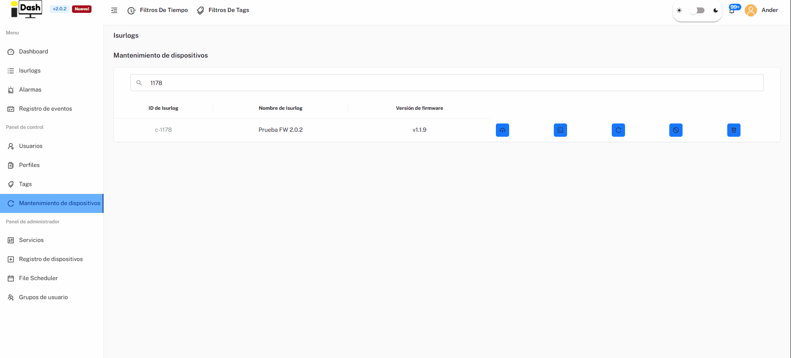

*Part of [6. IsurDASH Platform](isurdash-platform.md).*

# 6.8. Device Maintenance

The "**Mantenimiento de dispositivos**" menu lists every ISURLOG (ID, name, current firmware version) alongside a row of maintenance actions for each device:

* **Actualización de firmware:** update the device's firmware (see below).
* **MicroPython REPL:** open a remote Python REPL session on the device (see `remote_repl.py` in the firmware) for live debugging.
* **Reset de fábrica:** restore the device to its factory configuration.
* **Revocar acceso:** revoke the device's access/credentials. 🚧 *Not yet available.*
* **Fin de vida:** decommission the device. 🚧 *Not yet available.*

{width="1000"}

*The Mantenimiento de dispositivos list, with per-device maintenance actions.*

!!! warning
    Several of these actions (factory reset, revoke access, end of life) are destructive and not easily reversible — use with care.

## Firmware Update

Clicking **Actualización de firmware** opens a choice of update method:

* **Remoto:** updates the device over the air. Only available for devices already running firmware **v1.1.9 or newer**.
* **Serial port (USB):** updates the device over a wired connection. Available for **any** firmware version, including a blank/bricked ESP32. Requires a **UART-to-USB converter** connected between the ISURLOG and your computer — IsurDASH guides you step by step through the RST/BOOT button sequence needed to put the chip into download mode.

After picking a method, you choose which firmware version to install. The list of available versions is pulled directly from the project's [GitHub Releases page](https://github.com/isurki-tecnica/isurlog-firmware/releases). A few things to know about that list:

* Releases marked **Pre-release** are not recommended unless you specifically need a feature that only exists in that release.
* Always prefer the release marked **Latest** unless you have a specific reason not to.

{width="1000"}

*The firmware update flow — choose a method, then a version.*

!!! note "Building your own firmware?"
    This flow only installs official releases published on GitHub. If you're a firmware developer working from a locally-built `firmware.bin` that isn't (yet) a published release, use the manual flashing procedure instead — see **3. Flashing and Application Upload**.

## MicroPython REPL

Clicking **MicroPython REPL** connects you to the device's live MicroPython console (see `remote_repl.py` in the firmware) to run commands, inspect state, or debug. It's the same **REPL** button available on a device's own page (see [6.3.3](isurdash-devices.md#633-device-visualization-and-status)) — this section describes what it does.

As with firmware updates, there are two connection methods — **the REPL is never available over Bluetooth**; the Bluetooth connection (see [6.3.5](isurdash-devices.md#635-local-bluetooth-connection)) is only for real-time sensor visualization and local configuration, not for the REPL:

* **Remoto:** available on **any** ISURLOG version, but only for devices with an **NB-IoT or Wi-Fi** modem — LoRa devices don't support remote REPL.
* **Serial port (USB):** available for **all** devices regardless of modem, over a wired connection.

A few practical details:

* The console **times out automatically after 2 minutes** without a command.
* **Workaround:** once connected, you can raise this by editing the `REPL_TIMEOUT` variable yourself (in milliseconds), e.g.:

  ```python
  REPL_TIMEOUT = 120000
  ```

* The session can be **exported as a `.txt` file** for later reference.

{width="1000"}

*A live MicroPython REPL session.*
