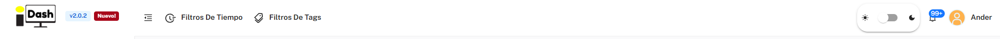

# 6. IsurDASH Platform

IsurDASH is the centralized web platform from which the entire fleet of **ISURLOG** dataloggers is managed. It is designed to offer an intuitive and powerful interface that allows users to not only view collected data but also configure and control the devices remotely.

All data sent by the **ISURLOG** is received on Isurki's secure servers, where it is stored indefinitely, guaranteeing that the history of measurements is never lost.

For advanced users, **[API access](data-access-overview.md)** is offered, allowing the integration of **ISURLOG** data into third-party applications or SCADA systems. Furthermore, for organizations requiring total control over their data, the IsurDASH platform can be installed on the client's own servers. For this custom installation option, contact Isurki.

## Top Toolbar

A toolbar is present at the top of **every** page in IsurDASH — not just the Dashboard:

{width="1000"}

*The top toolbar, present on every IsurDASH page.*

* **Filtros de tiempo:** restrict the data shown to a time window — quick presets (e.g. last 1 hour, last 2 hours) or a custom date range.
* **Filtros de Tags:** restrict the data shown to devices carrying specific [Tags](isurdash-tags.md).
* **Light/dark mode switch:** toggles the theme; saved per user.
* **Notification bell:** all notifications (alarms, low battery, etc.) across the fleet.
* **User button:** shows your username; opens a menu to edit your profile, configure notifications, manage access keys, and log out. *(Covered in detail in section 6.9, coming soon.)*

The two filters apply **globally**: once set, they affect what you see across [6.2. Dashboard](isurdash-dashboard.md) (the map only shows Isurlogs matching the selected tags, alarm counts adjust to the selected time window), [6.3. Devices](isurdash-devices.md) (Isurlogs list), [6.4. Alarms](isurdash-alarms.md), and Registro de eventos — every page reflects the same active filters until you change them.

## Contents

* **[6.1. First Steps: Access and Login](isurdash-access-login.md)** — creating your account and logging in.
* **[6.2. Main Control Panel (Dashboard)](isurdash-dashboard.md)** — the fleet map, alarms panel, and summary charts.
* **[6.3. Devices](isurdash-devices.md)** — the Isurlogs list, adding a device, per-device visualization and configuration, and local Bluetooth connection.
* **[6.4. Alarms](isurdash-alarms.md)** — fleet-wide alarm analytics and the full alarm history.
* **[6.5. Users](isurdash-users.md)** — user roles, creating users, and assigning devices.
* **[6.6. Profiles](isurdash-profiles.md)** — configuration templates you can apply to multiple devices at once.
* **[6.7. Tags](isurdash-tags.md)** — organizing and filtering the fleet with custom labels.
* **[6.8. Device Maintenance](isurdash-maintenance.md)** — firmware updates, remote REPL, factory reset, and other maintenance actions.
* **6.9. Account Settings** 🚧 — editing your profile, notification preferences, and access keys from the user menu. *(Coming soon.)*
