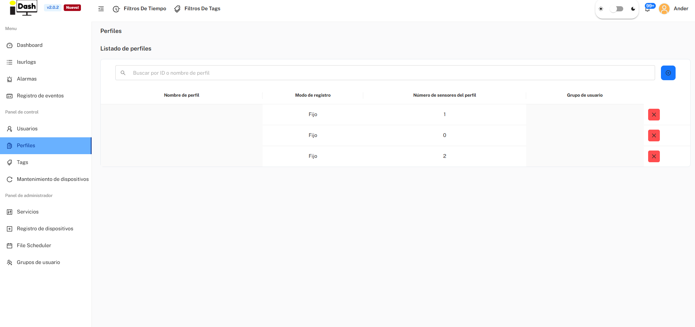
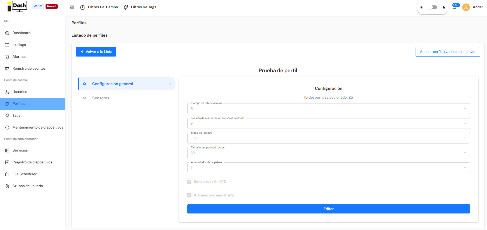

*Part of [6. IsurDASH Platform](isurdash-platform.md).*

# 6.6. Profiles

To facilitate the management and configuration of multiple **ISURLOG** dataloggers, the IsurDASH platform incorporates a powerful **Profiles** functionality.

A profile is a configuration template that groups a set of parameters and sensors. This way, if the user needs to deploy several **ISURLOGs** with an identical or very similar configuration (for example, to measure temperature at different points or for a group of tide gauges), it is not necessary to configure each device individually. A single profile can be created and applied to multiple **ISURLOGs** in a single action.

Furthermore, a profile can be used as a base configuration. It is possible to apply a profile to a device and subsequently access the configuration of that specific **ISURLOG** to make small individual adjustments.

!!! note "Note on firmware compatibility"
    IsurDASH shows the configurable parameters for the **latest** ISURLOG firmware version. When a profile is applied to a specific datalogger, some of those parameters may not be supported by that device's actual firmware version — in that case, the unsupported parameter is simply **discarded** for that device, while the rest of the profile is applied normally.

## 6.6.1. Profile List

Upon accessing the "**Profiles**" menu, a list of all configuration templates that have been created is presented. The table displays the following information:

| Column | Description |
| :--- | :--- |
| **Nombre de perfil** | The identifying name of the template. |
| **Modo de registro** | The device's logging mode for this profile (e.g. "Fijo"). |
| **Número de sensores del perfil** | How many sensors are defined within that template. |
| **Grupo de usuario** | The group to which the profile belongs. |

{width="1000"}

*The Profiles list.*

## 6.6.2. Create a New Profile

To create a new configuration template, the user (with the **Ingeniero** role) must follow these steps:

1.  **Initiate Creation:** Click on the blue button with the add symbol (**+**), located in the upper right corner.
2.  **Fill Out Form:** Fill out the form with the general parameters that will define the profile's base behavior:
    * **Grupo de usuario**
    * **Nombre de perfil**
    * **Tiempo de latencia**
    * **Sincronización RTC**
    * **Modo de registro**
    * **Acumulador de registros**

Upon saving, a base profile will be created which, initially, contains **no sensor configuration**.

## 6.6.3. Manage and Apply a Profile

By clicking on a profile already created in the list, the user accesses its detailed management screen — organized the same way as a device's Configuration tab, with **Configuración general** and **Sensores** in a left-hand sub-menu. From here, two main actions can be performed:

1.  **Configure the profile itself:** edit its general parameters (latency, sensor power voltage, logging mode, payload size, record accumulator, RTC sync, vandalism alarm) and add the sensors (digital, analog, Modbus inputs, etc.) that devices using this profile should read.
2.  **"Aplicar perfil a varios dispositivos":** selects one or more **ISURLOGs** from the fleet to massively apply this complete configuration template.

{width="1000"}

*Configuring a profile and applying it to multiple devices.*
