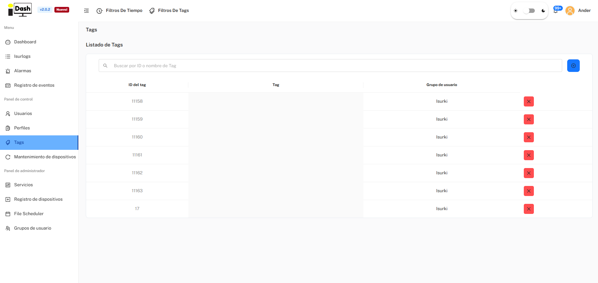
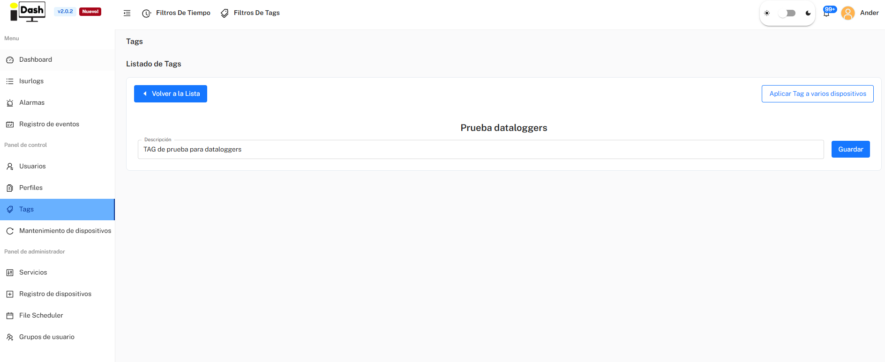

*Parte de [6. Plataforma IsurDASH](isurdash-platform.md).*

# 6.7. Tags

Las Tags (o Etiquetas) son marcadores personalizables diseñados para organizar, agrupar y filtrar la flota de dataloggers **ISURLOG** de forma más eficiente. Resultan especialmente útiles cuando se gestiona un gran número de dispositivos.

Un usuario puede crear tags basándose en cualquier criterio, como la ubicación geográfica (p. ej., "Zona Norte"), el tipo de instalación (p. ej., "Mareógrafos"), el proyecto al que pertenecen, o el cliente final. Una vez asignadas, estas tags permiten localizar y visualizar rápidamente grupos concretos de dispositivos en las distintas secciones de la plataforma.

## 6.7.1. Listado de Tags

El menú "**Tags**" presenta una tabla con todas las tags creadas dentro del grupo de usuario. El listado muestra las siguientes columnas:

| Columna | Descripción |
| :--- | :--- |
| **ID del tag** | El identificador único de la tag. |
| **Tag** | El nombre descriptivo de la tag. |
| **Grupo de usuario** | El grupo al que pertenece la tag. |

{width="1000"}

*El listado de Tags.*

## 6.7.2. Crear una Nueva Tag

Para crear una nueva tag que pueda asignarse a los dispositivos, el usuario debe seguir estos pasos:

1.  **Iniciar la creación:** pulsar el botón azul con el símbolo de añadir (**+**), situado en la esquina superior derecha.
2.  **Rellenar el formulario:** completar el formulario introduciendo el **Nombre de la Tag** y seleccionando el **Grupo de Usuario** al que pertenecerá.

## 6.7.3. Asignar Tags a Dispositivos

Una vez creada una tag, el siguiente paso es asignarla a los dispositivos correspondientes:

1.  **Seleccionar la tag:** el usuario debe pulsar sobre la tag deseada en el listado. Esto abre la pantalla de gestión de la tag, donde se puede editar y guardar su **Descripción**.
2.  **"Aplicar Tag a varios dispositivos":** abre una interfaz que permite seleccionar **uno o varios ISURLOG** de la flota para aplicarles esa tag.

{width="1000"}

*Asignar una tag a uno o varios dispositivos.*
