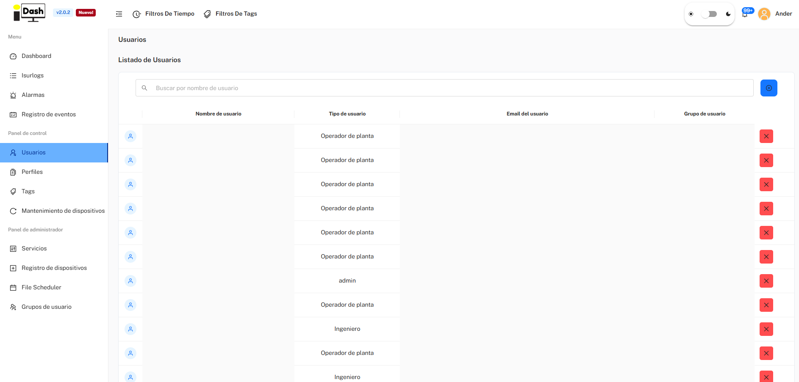
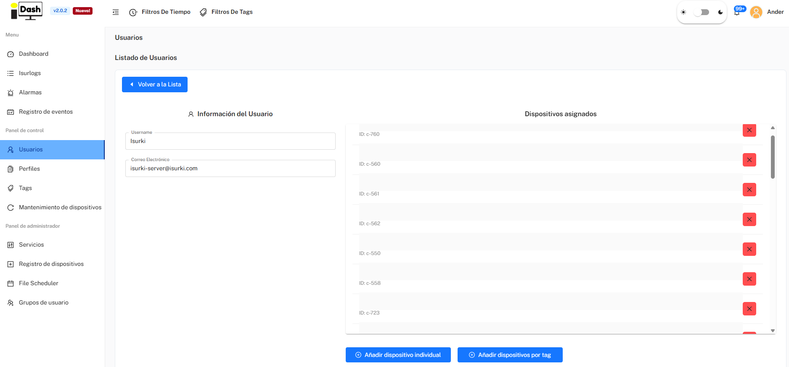

*Parte de [6. Plataforma IsurDASH](isurdash-platform.md).*

# 6.5. Usuarios

La plataforma IsurDASH permite la gestión multiusuario, asignando distintos roles y permisos para controlar el acceso a los datos y a la configuración. Los usuarios se organizan en "**Grupos**", y cada usuario solo podrá ver y gestionar a los demás miembros de su mismo grupo, garantizando así la privacidad entre distintos equipos o clientes.

## 6.5.1. Listado de Usuarios

La pantalla "**Usuarios**" muestra una tabla con todos los usuarios activos que pertenecen al mismo grupo que el usuario que ha iniciado sesión. Las acciones principales, como crear, editar o eliminar usuarios, se realizan desde esta interfaz.

La tabla ofrece la siguiente información:

| Columna | Descripción |
| :--- | :--- |
| **Nombre de usuario** | El nombre identificativo del usuario. |
| **Tipo de usuario** | El rol asignado (Ingeniero u Operador de planta). |
| **Email del usuario** | La dirección de email asociada a la cuenta. |
| **Grupo de usuario** | El grupo al que pertenece el usuario. |

{width="1000"}

*El listado de Usuarios.*

## 6.5.2. Roles y Permisos de Usuario

IsurDASH define dos roles de cara al cliente, con distintos niveles de acceso:

### 1. Operador de planta (Solo Lectura)

Un rol de solo lectura, ideal para el personal que necesita monitorizar datos sin poder realizar cambios que afecten al funcionamiento de los dispositivos. Tiene acceso a **Dashboard, Isurlogs, Alarmas** y **Registro de eventos**, y puede ver datos y recibir alarmas de todos los **ISURLOG** de su grupo — pero **no puede** editar la configuración de un dispositivo.

### 2. Ingeniero

Tiene todo lo que tiene un Operador de planta, además de la capacidad de **editar la configuración de los Isurlogs**, y acceso a los menús **Usuarios, Perfiles, Tags**, y **Mantenimiento de dispositivos** — es decir, puede crear/gestionar otros usuarios, perfiles y tags.

!!! note "Rol Admin"
    Existe un tercer rol, superior (**admin**), con acceso al Panel de administrador (Servicios, Registro de dispositivos, File Scheduler, Grupos de usuario) — se trata de un rol interno de Isurki, no algo que pueda asignarse o crearse desde una cuenta de cliente, por lo que queda fuera del alcance de esta guía.

## 6.5.3. Crear y Asignar un Nuevo Usuario

El proceso para dar de alta a un nuevo usuario en la plataforma y asignarle los dispositivos correspondientes es sencillo y se realiza en dos fases. Solo los usuarios con el rol **Ingeniero** pueden crear cuentas nuevas.

### Fase 1: Crear la Cuenta de Usuario

1.  Para iniciar el proceso, hay que pulsar el botón azul con el símbolo de añadir (**+**), situado en la esquina superior derecha de la pantalla "**Usuarios**".
2.  A continuación, hay que rellenar un formulario con los datos del nuevo usuario:
    * **Nombre de usuario**
    * **Tipo de usuario** (Ingeniero u Operador de planta)
    * **Email del usuario**
    * **Grupo de usuario**
3.  Al confirmar, IsurDASH enviará automáticamente un correo con un enlace de invitación a la dirección de email indicada. El nuevo usuario debe seguir ese enlace para establecer su contraseña personal y activar la cuenta antes de poder iniciar sesión.

### Fase 2: Asignar Dispositivos al Nuevo Usuario

Por defecto, una cuenta recién creada no tiene ningún **ISURLOG** asociado. Aunque el nuevo usuario podría añadirlos manualmente uno a uno, un Ingeniero puede preasignar los dispositivos correspondientes para facilitar y agilizar la puesta en marcha.

Para ello, el Ingeniero debe pulsar sobre el usuario recién creado en el listado. Se abrirá una interfaz que permite seleccionar y asignar los **ISURLOG** de dos formas:

* **"Añadir dispositivo individual":** permite seleccionar y asignar **ISURLOG** concretos de una lista.
* **"Añadir dispositivos por tag":** permite asignar simultáneamente todos los dispositivos que compartan una misma tag. Las tags son marcadores personalizables que se usan para agrupar y organizar la flota de **ISURLOG** (ver [6.7. Tags](isurdash-tags.md)).

La gran ventaja de este sistema es que esta asignación puede hacerse **inmediatamente después de crear la cuenta**, sin necesidad de esperar a que el nuevo usuario la active a través del correo de invitación.

De esta forma, cuando el nuevo usuario inicia sesión por primera vez, ya encontrará los dispositivos **ISURLOG** correspondientes en su panel, listos para ser monitorizados.

{width="1000"}

*Preasignar ISURLOG a un usuario recién creado.*
