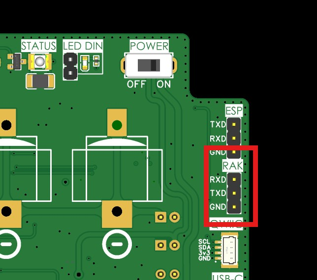
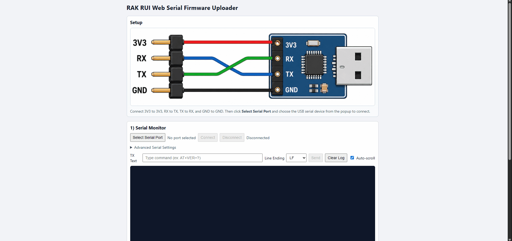

# 6. Advanced LoRaWAN Modem Guide

This guide is intended for developers who need to modify, compile, or flash custom applications onto the **RAK3172** modem used by the ISURLOG, replacing the default AT command application.

## 6.1 Firmware Architecture (RUI3 Framework)

When developing for the RAK3172, the software environment relies on the **RUI3 (RAKwireless Unified Interface V3)** platform. It is important to understand how the module can be utilized:

1. **Default AT Command Firmware:** The module comes pre-flashed with the standard RUI3 AT command firmware. In this ecosystem, the RAK3172 acts as a standard communication peripheral controlled completely by the ESP32 via serial interface queries. 
2. **Custom Application Firmware (Arduino API):** RUI3 allows developers to compile and run standalone custom C++/Arduino applications directly inside the RAK3172’s internal STM32WLE55 microcontroller. This layer can bypass the external controller for specific tasks or fully customize how the radio stack behaves.

---

## 6.2 Prerequisites and SDK Installation

To develop, modify, or compile custom application firmware for the RAK3172 using the RUI3 framework, you must configure a compatible development environment.

### Supported IDEs
The RAK3172 RUI3 core natively supports development via the **Arduino IDE** or Visual Studio Code (with PlatformIO extension).

* **Setup and Installation:** To install the necessary RAKwireless Board Support Package (BSP) in your development environment, follow the official instructions: [https://docs.rakwireless.com/product-categories/software-apis-and-libraries/rui3/supported-ide](https://docs.rakwireless.com/product-categories/software-apis-and-libraries/rui3/supported-ide)

### RUI3 Arduino API Reference
When compiling custom firmware to run natively on the module, developers can leverage the unified Arduino API provided by RAKwireless to manage LoRaWAN parameters, internal hardware, and peripherals: [https://docs.rakwireless.com/product-categories/software-apis-and-libraries/rui3/arduino-api](https://docs.rakwireless.com/product-categories/software-apis-and-libraries/rui3/arduino-api)

!!! note "See Also"
    For the physical hardware needed to flash the modem, see **[6.5 Flashing Hardware Requirements and Connection](#65-flashing-hardware-requirements-and-connection)** below.

---
## 6.3 UART Communication and AT Commands

The ISURLOG uses the RAK3172 module to establish LoRaWAN communication via a hardware UART port (`UART1`) using **AT commands**. The default serial configuration between the ESP32 and the RAK3172 is:

* **TX:** GPIO2
* **RX:** GPIO4
* **Baudrate:** 115200 8N1

!!! note "Reference"
    The complete and official RUI3 AT Command Manual for managing network joining (OTAA/ABP), keys (DevEUI, AppEUI, AppKey), and data transmission configurations can be found here: [https://docs.rakwireless.com/product-categories/software-apis-and-libraries/rui3/at-command-manual/](https://docs.rakwireless.com/product-categories/software-apis-and-libraries/rui3/at-command-manual/)

    If you're building a **replacement** application firmware for the modem, it must keep supporting the same AT command surface the ISURLOG's own driver (`modules/lorawan.py`) actually depends on — see the verified command list in **[2.1 Module & Library Reference](module-library-reference.md)** as a compatibility checklist.

---
## 6.4 Advanced Energy Management:

The RAK3172 is highly optimized for ultra-low power consumption. When the system is in an idle state between datalogging intervals, the ESP32 can transition the LoRaWAN module into its lowest consumption state via software commands:

* **Sleep Command:** Sending the `AT+SLEEP` command puts the module into low-power sleep mode (dropping current consumption down to microamps).
* **Wake-Up Routine:** The RAK3172 can be automatically awakened from sleep mode by detecting falling edges/activity on the UART RX line. Sending a dummy character sequence from the ESP32's TX line wakes up the module, making it instantly ready to receive subsequent operational AT commands.

In addition to data communication via the UART port, the ESP32 and the RAK3172 module are connected through a dedicated GPIO line. This connection enables dynamic and efficient management of the host processor's low-power modes, optimizing the autonomy of the **ISURLOG**.

The connection between the modules is as follows:

| Name | Pin ESP32 | Pin RAK3172 | Description |
| :--- | :--- | :--- | :--- |
| **ESP_WAKE_UP** | GPIO35 (Input) | PA8 (Output) | Digital input used to wake up the ESP32 when the LoRaWAN module receives a downlink packet from the gateway/server. |

This functionality is particularly useful when the RAK3172 module operates in **LoRaWAN Class B** (synchronized beacons) or **Class C** (continuous listening) modes. The `ESP_WAKE_UP` signal enables the RAK3172 to immediately activate the ESP32 whenever an asynchronous **downlink data packet** is received from the network. Once awake, the ESP32 can communicate with the RAK3172 via UART to process the incoming data or commands. 

This "wake-on-demand" capability allows the ESP32 to remain in deep sleep indefinitely, significantly reducing the system's power consumption while maintaining near-zero latency for remote server configurations or downlinks.

---
## 6.5 Flashing Hardware Requirements and Connection

The ISURLOG board does not include an integrated USB-to-UART converter for the RAK3172 to maintain a minimalist, cost-effective, and low-power hardware profile. 

### Required Flashing Hardware
* **Converter:** An external **UART TTL to USB converter**.
* **Connection:** Jumper wires or a dedicated programming header compatible with the board's design.

!!! warning "Important (Bootloader Mode)"
    Before compiling and uploading a new sketch or firmware from the Arduino IDE, you must put the RAK3172 into bootloader mode by sending the command `AT+BOOT` over the serial interface.

### Physical Connection

To physically flash new firmware, update the RUI3 core, or upload an Arduino sketch onto the RAK3172, you must route the programming serial interface lines of the module to your PC using the external UART TTL to USB converter.

The connection workflow requires matching the converter's **TX**, **RX** and **GND** to the corresponding programming pins of the RAK3172 on the PCB.

The programming port/pins for the RAK3172 module on the ISURLOG PCB are located as shown below:

{: width="750" }

*The programming port, for the RAK3172 modem.*

## 6.6 Updating Modem Firmware from Official Binaries

Unlike the scenarios above (which assume you're compiling your own application firmware from source), you don't need the Arduino IDE or the RUI3 BSP at all if you just want to update the modem to an **official ISURKI-provided build** — it's an already-compiled binary.

### Where to Get the Binary

Each [ISURLOG firmware release](https://github.com/isurki-tecnica/isurlog-firmware/releases) includes a `rak3172_bins.zip` asset (alongside the ESP32 and nRF9151 binaries) containing a single file:

* **`System_Custom_ATCMD.ino.bin`**

!!! note "🚧 Coming soon"
    IsurDASH will support updating the RAK3172 directly, the same way the [6.8 Device Maintenance](isurdash-maintenance.md) flow already updates the **ESP32**. Until then, use the tool below.

### Update Tool

The current recommended way to update the RAK3172's firmware is the web-based tool at **[firmwareupgrade.fencyboy.com](https://firmwareupgrade.fencyboy.com/)**.

### Update Procedure

1.  Connect the UART-to-USB converter to the ISURLOG's "**RAK**" port.
2.  Power on the ISURLOG in **BOOT** mode.
3.  Select the serial port in the tool and connect.
4.  Send the `AT+BOOT` command and confirm the module responds correctly.
5.  Select the **`System_Custom_ATCMD.ino.bin`** file and click **"Upload firmware"**.

{: width="1000" }

*Updating the RAK3172 modem firmware via the web-based tool.*
