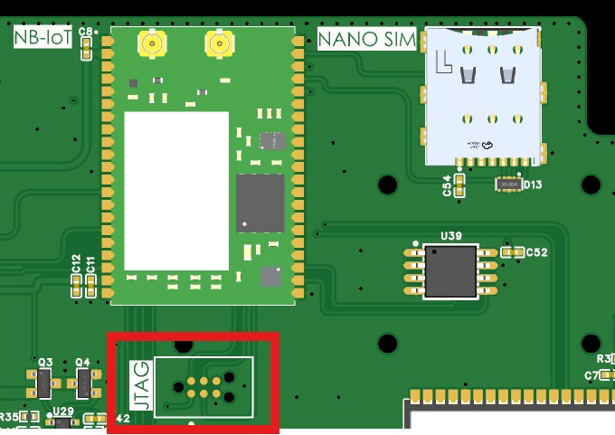
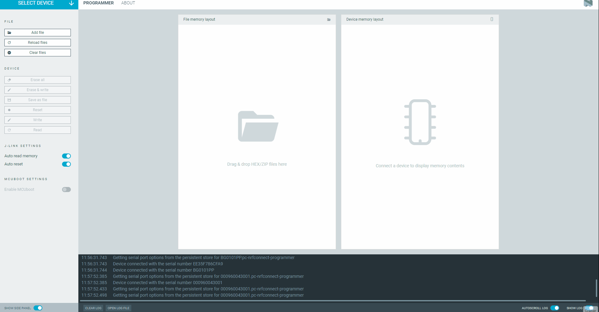

# 5. Advanced NB-IoT Modem Guide

This guide is intended for developers who need to modify, compile, or flash custom applications onto the **nRF9160** modem (Actinius-SoM) used by the ISURLOG, replacing the default AT command application.

## 5.1 Firmware Architecture Distinction

When developing for the nRF9160, it is crucial to distinguish between two distinct layers of software:

1.  **Modem Firmware (Low-Level Radio Stack):** This is the internal firmware that controls the radio protocols (LTE-M/NB-IoT), security, and signal processing. The firmware can be updated using the **Programmer** app inside **nRF Connect for Desktop**. **It is usually not necessary to update this firmware**, as the factory version is typically stable.
    * **Download Location:** The modem firmware can be obtained directly from Nordic Semiconductor by downloading the ZIP package for the desired version: [https://www.nordicsemi.com/Products/nRF9160/Download?lang=en#infotabs](https://www.nordicsemi.com/Products/nRF9160/Download?lang=en#infotabs).

2.  **Application Firmware (Program):** This is the code that runs *on top* of the modem firmware, such as the **serial_lte_modem** (the AT command interpreter) or any other custom application. This is the layer that developers typically modify and flash.

---

## 5.2 Prerequisites and SDK Installation

To compile Application Firmware for the nRF9160, you must install the Nordic Semiconductor toolchain, which is managed through nRF Connect for Desktop.

### Installation Procedure

1.  Install **nRF Connect for Desktop**.
2.  Launch nRF Connect for Desktop and install the **Toolchain Manager** application.
3.  Open the Toolchain Manager and install **nRF Connect SDK v.2.6.2**. We recommend this version for optimal compatibility with the ISURLOG base firmware.

!!! note
    For the physical hardware needed to flash the modem (programmer, cable, connection), see **5.6 Flashing Hardware Requirements and Connection** below.

---
## 5.3 UART Communication and AT Commands

The ISURLOG uses the nRF9160 modem to establish NB-IoT communication via a UART port and **AT commands**. The default UART port configuration (ESP32 side) is:

* **TX:** GPIO4
* **RX:** GPIO2
* **Baudrate:** 115200 8N1

!!! note "Reference"
    The complete and official AT command reference for the nRF9160 modem can be found in the Nordic Semiconductor documentation: [https://docs.nordicsemi.com/bundle/ncs-latest/page/nrf/applications/serial_lte_modem/README.html](https://docs.nordicsemi.com/bundle/ncs-latest/page/nrf/applications/serial_lte_modem/README.html)

    If you're building a **replacement** application firmware for the modem, it must keep supporting the same AT command surface the ISURLOG's own driver (`modules/nb_iot.py`) actually depends on — see the verified command list in **[2.1 Module & Library Reference](module-library-reference.md)** as a compatibility checklist.

---
## 5.4 Advanced Energy Management: ESP32 - nRF9160 Pins

In addition to data communication via the UART port, the ESP32 and the nRF9160 modem are connected through two dedicated GPIO lines. These connections enable dynamic and efficient management of both processors' low-power modes, optimizing the autonomy of the **ISURLOG**.

The connection between the modules is as follows:

| Name | Pin ESP32 | Pin nRF9160 | Description |
| :--- | :--- | :--- | :--- |
| **ESP_WAKE_UP** | GPIO35 (Input) | GPIO30 (Output) | Digital input used to wake up the ESP32 when the NB-IoT module is in eDRX mode and receives a data packet. |
| **NRF_WAKE_UP** | GPIO26 (Output) | GPIO31 (Input) | Digital output used to wake up the NB-IoT module from the ESP32 when the NB-IoT module is in sleep mode. |

This functionality is particularly useful when the nRF9160 modem operates in **eDRX (Extended Discontinuous Reception)** mode. The `ESP_WAKE_UP` signal enables the nRF9160 modem to activate the ESP32. Once awake, the ESP32 can communicate with the nRF9160 via UART to process the received data. This "wake-on-demand" capability significantly reduces the latency for receiving commands or configurations from the server.

---
## 5.5 SIM Selection and GPIO Control

The nRF9160 modem selects between the **eSIM** and the **Nano-SIM** based on the state of **GPIO12**. The ESP32 can control the state of GPIO12 via AT commands.

**1. Configure GPIO12 as Output:**

`AT#XGPIOCFG=1,12`

**2. Set GPIO12 High/Low (Select SIM):**

`AT#XGPIO=0,12,val` (where `val` is the desired value, 0 for low and 1 for high).

## 5.6 Flashing Hardware Requirements and Connection

To physically load new firmware onto the nRF9160 modem, specialized hardware is required:

* **Programmer:** A **Segger J-Link** programmer.
* **Connection Method:** A **Tag-Connect** cable or equivalent connector compatible with the nRF9160's JTAG port.

### Physical Connection

The programming sequence involves connecting the **J-Link** programmer to your PC via USB. You then connect the programmer to the **JTAG port** on the ISURLOG PCB using the Tag-Connect cable.

The JTAG port on the ISURLOG PCB (which is the programming port for the nRF9160 modem) is located as shown below:

{ width="502" }

*The JTAG programming port, for the nRF9151 modem.*

## 5.7 Updating Modem Firmware from Official Binaries

Unlike the scenarios above (which assume you're compiling your own application firmware from source), you don't need the nRF Connect SDK at all if you just want to update the modem to an **official ISURKI-provided build** — only **nRF Connect for Desktop** is required, since these are already-compiled binaries.

### Where to Get the Binaries

Each [ISURLOG firmware release](https://github.com/isurki-tecnica/isurlog-firmware/releases) includes an `nrf9151_bins.zip` asset (alongside the ESP32 binaries) containing:

* **`merged.hex`** — the Application Firmware (`serial_lte_modem` / AT command interpreter).
* **`mfw_nrf91x1_x.x.x.zip`** — the Modem Firmware (radio stack).

Updating either (or both) is how you pick up bug fixes or improvements to the modem side of the ISURLOG without touching the ESP32 firmware.

### Required Hardware

* A programmer board: **[nRF9160-DK](https://www.digikey.es/es/products/detail/nordic-semiconductor-asa/NRF9160-DK/9740721)**.
* A **[6-pin TAG-Connect cable](https://www.tag-connect.com/product/tc2030-ctx-nl-6-pin-no-legs-cable-with-10-pin-micro-connector-for-cortex-processors)**.
* **[nRF Connect for Desktop](https://www.nordicsemi.com/Products/Development-tools/nRF-Connect-for-Desktop)** installed (no SDK/toolchain needed for this).

### Connection

* The nRF9160-DK connects to your computer via USB.
* The nRF9160-DK's "**nRF91 Debug In**" connector goes to the ISURLOG's **JTAG port** (underside of the PCB) via the TAG-Connect cable.
* The ISURLOG is powered from its batteries.

### Update Procedure

1.  Power on the ISURLOG and put the ESP32 into **BOOT** mode.
2.  Power on the nRF9160-DK.
3.  Open **nRF Connect for Desktop** and launch the **Programmer** app.
4.  Select the **nRF9160-DK** device.
5.  Use **"Add file"** to load either binary:
    1.  For **`merged.hex`**: click **"Erase and write"** and wait for it to finish.
    2.  For **`mfw_nrf91x1_x.x.x.zip`** (the zip itself, not extracted): click **"Write"** and wait for it to finish.
6.  The order doesn't matter — you can flash `merged.hex` or the modem firmware zip first.

{ width="1000" }

*Flashing merged.hex followed by the modem firmware, in the Programmer app.*
