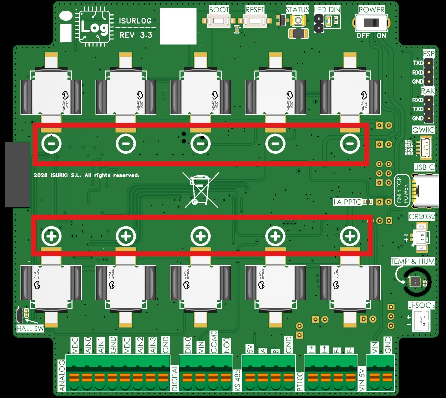
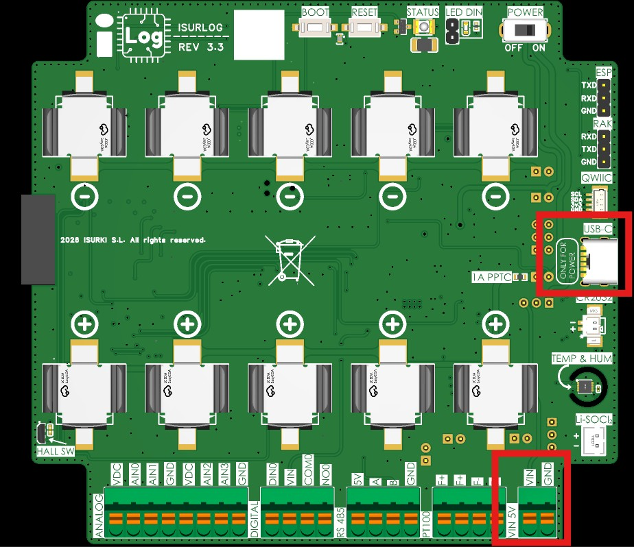
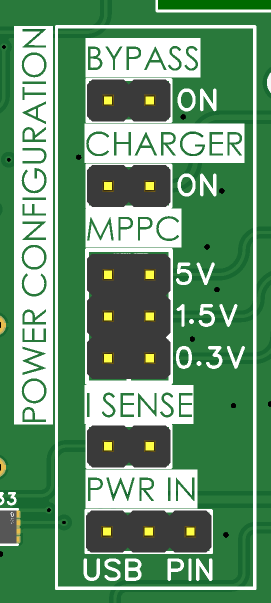
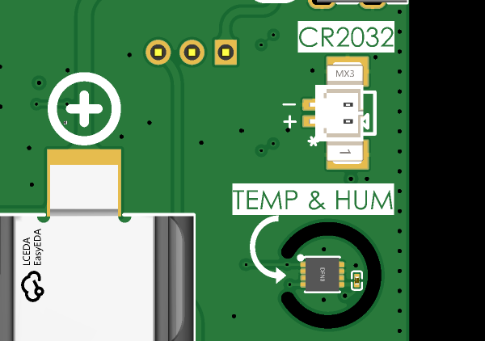

# 2. Métodos de Alimentación

El ISURLOG ofrece distintas opciones de alimentación para adaptarse al mayor número de situaciones posible.

## 2.1. Opciones de Alimentación

El ISURLOG incorpora un cargador de batería y una circuitería de gestión de energía integrados, que permiten tres modos de funcionamiento.

!!! note "Nota de instalación"
    Para el procedimiento paso a paso de instalación y extracción de las baterías, consultar la sección **[4. Instalación y Puesta en Marcha](installation-commissioning.md)**.

### 2.1.1. Solo Baterías Internas

El dispositivo dispone de cinco portapilas en su parte superior para alojar hasta un máximo de cinco baterías **INR18650**, con una capacidad total de **17000 mAh**. No es necesario usar las cinco baterías; se puede instalar solo una o todas.

* **Aviso de polaridad:** las baterías deben colocarse respetando las polaridades indicadas en la PCB. **No respetar la polaridad puede dañar la PCB de forma irreparable**.
* **Requisito de seguridad:** es importante que todas las baterías conectadas a un mismo ISURLOG tengan el mismo nivel de carga (la misma tensión).

{width="880"}

*Los cinco portapilas INR18650 — respetar la polaridad marcada en la PCB.*

### 2.1.2. Solo Alimentación Externa

El dispositivo puede alimentarse externamente sin baterías. La fuente de alimentación debe proporcionar una tensión entre **4V y 5V**.

* **Puntos de conexión:**
    1.  **Puerto USB-C:** situado en la parte inferior derecha de la PCB. Puede usarse un cargador de móvil convencional de 5V con una **corriente mínima de 1A**.
    2.  **Terminales de presión (PIN 5V MAX):** los dos últimos terminales de presión de la parte inferior derecha.

!!! warning "Precaución"
    No usar el puerto USB-C y los terminales de presión simultáneamente como fuentes de alimentación.

{width="883" height="789"}

*Conexiones de alimentación externa — puerto USB-C y terminales de presión PIN.*

### 2.1.3. Baterías + Alimentación Externa (Modo Híbrido)

La última opción para alimentar el **ISURLOG** es combinar las baterías con alimentación externa. En este modo, la PCB utiliza la alimentación externa mientras esté disponible, y conmuta a las baterías cuando la alimentación externa se interrumpe. Este modo resulta útil para funcionar con baterías y un panel solar, o para seguir operando durante cortes de la alimentación externa. Las baterías se mantienen cargadas mediante el cargador integrado en la PCB, que las carga con una corriente máxima de **400mA**.

### 2.1.4. Baterías No Recargables (Li-SOCl2)

!!! note "Nota de hardware"
    Esta opción solo está disponible en revisiones de PCB **ISURLOG v3.3 y posteriores**.

A partir de la revisión de hardware v3.3, el ISURLOG incorpora un **conector PH-2A** dedicado, marcado como **Li-SOCl2** en la PCB, para alimentar el dispositivo con baterías no recargables de litio-cloruro de tionilo (Li-SOCl2). Esta opción es idónea para instalaciones de larga duración y bajo mantenimiento, en las que la recarga periódica no resulta práctica.

## 2.2. Configuración de Jumpers para los Modos de Alimentación

Cada uno de los modos de alimentación descritos en los apartados anteriores requiere una configuración específica de jumpers en la PCB del **ISURLOG**. **Es totalmente necesario configurar estos jumpers correctamente para garantizar un suministro de energía estable**. Los jumpers están situados en la cara inferior de la PCB.

{width="176" height="334"}

*Los jumpers de alimentación, cara inferior de la PCB.*

!!! note "Qué hace I SENSE"
    Toda la corriente de las baterías pasa por el jumper **I SENSE** — como su nombre indica, es el punto donde se puede medir la corriente. En funcionamiento normal debe permanecer **cerrado** (posición ON, en cortocircuito), como se indica más abajo para cada modo de alimentación. Para medir el consumo real del dispositivo, abrir el jumper e insertar un amperímetro en serie en ese punto — ver [Gráficos de Consumo](consumption-graphs.md) para el procedimiento de medida completo y capturas reales.

#### Solo Baterías

Para alimentación exclusivamente con baterías, es necesaria la siguiente configuración:

* **Charger:** desactivado
* **MPPC:** la configuración de los jumpers MPPC es indiferente en este caso, pero se recomienda la siguiente configuración para la máxima eficiencia energética:
    * 5V desactivado
    * 1.5V desactivado
    * 0.3V desactivado
* **I SENSE:** posición ON
* **PWR IN:** indiferente

#### Solo Alimentación Externa

Para alimentación exclusivamente externa, es necesaria la siguiente configuración:

* **Charger:** desactivado
* **MPPC:**
    * 5V desactivado
    * 1.5V desactivado
    * 0.3V desactivado
* **I SENSE:** posición ON
* **PWR IN:**
    * Para alimentar por el puerto USB, es necesario retirar todos los jumpers de PWR IN.
    * Para alimentar por el puerto PIN, es necesario unir el pin 1 con el pin 3 del jumper PWR IN.

#### Baterías + Alimentación Externa (Modo Híbrido)

Para alimentación con baterías + alimentación externa, es necesaria la siguiente configuración:

* **Charger:** posición ON
* **MPPC:** es necesario seleccionar **solo una** de las tres tensiones de entrada disponibles.
    * 5V: activado si la tensión de la fuente externa es de 5V; desactivado en caso contrario.
    * 1.5V: activado si la tensión de la fuente externa es de 1.5V; desactivado en caso contrario.
    * 0.3V: activado si la tensión de la fuente externa es de 0.3V; desactivado en caso contrario.
* **I SENSE:** posición ON
* **PWR IN:**
    * Para alimentación externa por el puerto USB, es necesario unir el pin 1 y el pin 2 del jumper PWR IN, la **posición USB**.
    * Para alimentación externa por el puerto PIN, es necesario unir el pin 2 y el pin 3 del jumper PWR IN, la **posición PIN**.

#### Baterías No Recargables (Li-SOCl2)

!!! note "Nota de hardware"
    El jumper **BYPASS** solo está presente en revisiones de PCB **ISURLOG v3.3 y posteriores**.

Para alimentación exclusivamente con baterías Li-SOCl2 no recargables a través del conector PH-2A, es necesaria la siguiente configuración:

* **Charger:** desactivado
* **MPPC:**
    * 5V desactivado
    * 1.5V desactivado
    * 0.3V desactivado
* **I SENSE:** posición ON
* **BYPASS:** activado

!!! warning "Importante"
    El Charger y las tres entradas MPPC deben permanecer **desactivados** siempre que se usen baterías Li-SOCl2 — estas celdas no recargables no deben conectarse nunca al circuito de carga.

#### Ejemplos de Fuentes de Alimentación para la Entrada MPPC

El ajuste de entrada **MPPC (Maximum Power Point Control)**, usado en el Modo Híbrido, permite al **ISURLOG** cargar baterías de forma eficiente a partir de distintas fuentes de baja tensión:

* **Entrada 5V:** esta fuente de alimentación externa puede ser un **panel solar de 5V** (equipado con un regulador, ya que muchos paneles producen picos de tensión elevados aunque su tensión nominal sea de 5V) o un **cargador de 5V** estándar.
* **Entrada 1.5V:** esta tensión de entrada es típicamente compatible con un **micropanel solar**.
* **Entrada 0.3V:** esta tensión ultrabaja se usa a menudo con un **TEG (generador termoeléctrico)**, lo que hace al dispositivo apto para aplicaciones de recolección de energía (*energy harvesting*).

## 2.3. Batería de Respaldo del RTC (CR2032)

El **ISURLOG** incluye un reloj de tiempo real (RTC) de ultra bajo consumo que mantiene la hora actual. En funcionamiento normal, este RTC se alimenta del mismo raíl de **3V3** que el resto de la placa — por lo que, cuando el datalogger pierde la alimentación por completo, o se apaga con el botón **POWER**, el RTC también pierde la alimentación y la hora actual se pierde.

!!! note "Normalmente esto no supone un problema"
    El firmware estándar incluye detección automática de pérdida de hora y resincronización, en cualquier variante de conectividad (NB-IoT, LoRaWAN o Wi-Fi): una pérdida de hora del RTC se detecta y corrige automáticamente la próxima vez que el dispositivo se conecta.

Para instalaciones en las que perder la hora es crítico, o para compilaciones de firmware personalizadas que no implementen esta resincronización — o que funcionen exclusivamente como datalogger de almacenamiento local, sin transmisión — puede conectarse una pila de botón **CR2032** para mantener el RTC alimentado de forma independiente a la alimentación principal.

* **Conector:** 2 pines, paso **P=1,25mm**, marcado como **CR2032** en la PCB.
* **Polaridad:** el pin positivo está marcado con un asterisco (*).

{width="300"}

*El conector CR2032 — el asterisco marca el pin positivo.*
