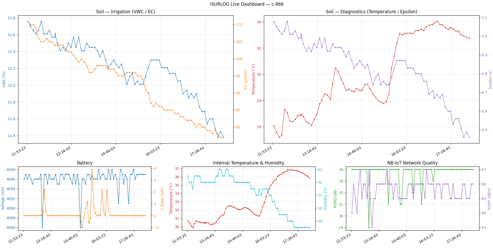

# 3. Datos en Tiempo Real vía MQTT (Método Push)

## 3.1 Resumen

Este método de integración está pensado para aplicaciones que necesitan **acceso inmediato a los datos**, como dashboards de monitorización en vivo, sistemas de alerta en tiempo real, o automatización dirigida por eventos. La plataforma Isurlog envía los datos a un broker MQTT en el instante en que se reciben de un dispositivo.

### Formato de los Datos

Los datos se publican como un **payload binario en bruto** (representado como una cadena hexadecimal) para maximizar la eficiencia y minimizar el consumo de datos en redes celulares. Por ello, la aplicación cliente **debe decodificar este payload** para interpretar los valores de los sensores.

---

## 3.2 Parámetros de Conexión

Para recibir el flujo de datos en tiempo real, los clientes deben conectarse al broker MQTT de Isurlog usando los siguientes parámetros seguros:

* **Broker URL:** `mqttisurdash.isurki.com`
* **Puerto (TLS):** 8883 (la conexión segura mediante TLS es obligatoria)
* **Versión MQTT:** el broker soporta clientes MQTT v5.0 y v3.1.1.
* **Usuario / Contraseña:** se proporcionará un usuario y contraseña únicos para un acceso seguro.

---

## 3.3 Estructura de Topics y Formato del Mensaje

La estructura del topic y el formato del mensaje dependen de la tecnología de comunicación usada por el dispositivo (LoRaWAN o NB-IoT).

### 3.3.1 Dispositivos LoRaWAN (vía ChirpStack)

Los datos LoRaWAN se procesan a través del Network Server ChirpStack.

* **Estructura del Topic:** `application/{application-id}/device/{device_eui}/event/up`
* **Formato del Mensaje:** **objeto JSON con datos decodificados**. El Network Server ChirpStack decodifica automáticamente el payload en bruto. Los valores de sensores decodificados están disponibles directamente dentro de la clave `object` del JSON.
* **Metadatos:** el JSON también incluye metadatos de red útiles, como RSSI, SNR, ubicación del gateway, y parámetros de transmisión.

#### Ejemplo de Payload JSON (ChirpStack)

Este ejemplo muestra la estructura y el contenido clave del campo `object` con las lecturas decodificadas:

```json
{
  "deviceInfo": {
    "applicationName": "Isurlog",
    "deviceName": "c-123",
    "devEui": "xxxxxxxxxxxxx"
  },
  "fCnt": 61,
  "fPort": 2,
  "data": "AHVoyD3dAHQP5wAAAABnAPcAaIcAAv+d",
  "object": {
    "AnalogInput_0": -0.99,
    "DigitalInput_0": 0.0,
    "HumiditySensor_0": 67.5,
    "TemperatureSensor_0": 24.7,
    "UnixTime_0": 1757953501.0,
    "VoltageInput_0": 4071.0
  },
  "rxInfo": [
    {
      "gatewayId": "b827ebfffe70a454",
      "rssi": -51,
      "snr": 6.2
    }
  ],
  "txInfo": {
    "frequency": 867500000,
    "modulation": {
      "lora": {
        "spreadingFactor": 7
      }
    }
  }
}
```

### 3.3.2 Dispositivos NB-IoT

* **Estructura del Topic:** `isurlog/datos/{device_id}`
* **Formato del Mensaje:** **payload binario en bruto** (cadena hexadecimal).

---

## 3.4 Decodificación del Payload (NB-IoT/Cayenne LPP)

El formato de payload de Isurlog es una variante del **Cayenne Low Power Payload (LPP)**. Este formato es muy eficiente y permite enviar múltiples lecturas de sensores en un único mensaje.

### Estructura del Payload

Cada payload consiste en uno o más fragmentos de datos concatenados. Cada fragmento sigue la estructura:

`Canal (1 byte) | Tipo de dato (1 byte) | Valor (N bytes)`

* **Canal:** un identificador definido por el usuario para la fuente de datos (0–255), que normalmente corresponde a la entrada física del Isurlog.
* **Tipo de dato:** un código de 1 byte que especifica el tipo de dato enviado (p. ej., temperatura, tensión).
* **Valor:** la lectura en bruto del sensor, codificada en N bytes.

Todos los valores multibyte se codifican en orden **Big-Endian**. El primer payload de datos transmitido siempre empieza con un fragmento de Marca de Tiempo Unix (Tipo 0x75).

### Referencia de Tipos de Dato

| Nombre del Sensor | Canal | Tipo (Hex) | Formato de Dato | Cálculo del Valor |
| :--- | :--- | :--- | :--- | :--- |
| **Digital Input** | 0 | 0x00 | Entero sin signo de 1 byte | Valor final = Entero |
| **Analog Input** | 0-3 | 0x02 | Entero con signo de 2 bytes | Valor final = Entero / 100.0 |
| **Modbus Input** | 0-3 | 0x04 | Entero con signo de 2 bytes | Valor final = Entero / 100.0 |
| **PT100 Temperature** | 0 | 0x66 | Entero con signo de 2 bytes | Valor final = Entero / 10.0 |
| **Temperature Sensor** | 0 (interno) / 1 (externo, QWIIC) | 0x67 | Entero con signo de 2 bytes | Valor final = Entero / 10.0 |
| **Humidity Sensor** | 0 (interno) / 1 (externo, QWIIC) | 0x68 | Entero sin signo de 1 byte | Valor final = Entero / 2.0 |
| **Accelerometer** | 0 | 0x71 | 6 bytes = tres enteros con signo de 2 bytes (X, Y, Z) | Valor final (por eje) = Entero / 1000.0 (g) |
| **Battery Voltage** | 0 | 0x74 | Entero sin signo de 2 bytes | Valor final = Entero (en mV) |
| **Unix Timestamp** | 0 | 0x75 | Entero sin signo de 4 bytes | Valor final = Entero (segundos) |
| **Battery C-Rate** | 0 | 0x77 | Entero con signo de 1 byte | Valor final = Entero / 10.0 (%/h) |
| **Modem Signal Quality** | 0 (RSRQ) / 1 (RSRP) | 0x78 | Entero sin signo de 1 byte | Valor final = Entero (canal 0: dB · canal 1: dBm). **Solo dispositivos NB-IoT.** |

!!! note "Nota sobre la semántica del canal"
    Para la mayoría de los tipos de sensor, el canal identifica de qué entrada física proviene la lectura (p. ej. Analog Input 0-3). Para **Accelerometer**, el mismo fragmento empaqueta los tres ejes juntos (no hay un canal separado por eje). Para **Modem Signal Quality**, el canal se reutiliza para distinguir la *métrica* (0 = RSRQ, 1 = RSRP) en vez de una entrada física.

## 3.5 Ejemplo: Decodificando un Payload de Datos

Considera el siguiente payload de ejemplo, recibido como cadena hexadecimal:
`007568C7D98100741024006701370068400002021D`

Este payload contiene una marca de tiempo seguida de cuatro lecturas de sensores. La aplicación cliente debe procesar el payload en fragmentos concatenados:

### Fragmento 1: Marca de Tiempo

* **Bytes:** `007568C7D981`
* **Tipo:** `0x75` (Marca de Tiempo Unix)
* **Valor:** `0x68C7D981` (1757927809 en decimal)
* **Resultado:** la hora de referencia de este registro de datos es 1757927809 (correspondiente al 15 de septiembre de 2025, 09:16:49 UTC).

### Fragmento 2: Tensión de Batería

* **Bytes:** `00741024`
* **Tipo:** `0x74` (Tensión de Batería)
* **Valor:** `0x1024` (4132 en decimal)
* **Resultado:** 4132 mV

### Fragmento 3: Temperatura Interna

* **Bytes:** `00670137`
* **Tipo:** `0x67` (Sensor de Temperatura Interna)
* **Valor:** `0x0137` (311 en decimal, con signo)
* **Cálculo:** 311 / 10.0 = 31.1 °C

### Fragmento 4: Humedad Interna

* **Bytes:** `006840`
* **Tipo:** `0x68` (Sensor de Humedad Interna)
* **Valor:** `0x40` (64 en decimal)
* **Cálculo:** 64 / 2.0 = 32.0%

### Fragmento 5: Entrada Analógica

* **Bytes:** `0002021D`
* **Tipo:** `0x02` (Analog Input)
* **Valor:** `0x021D` (541 en decimal, con signo)
* **Cálculo:** 541 / 100.0 = 5.41 (en unidades de ingeniería)

## 3.6 Implementación de Referencia

En el archivo adjunto **`isurlog_mqtt_demo.py`** se ofrece un script completo en Python que muestra la conexión, la suscripción, la decodificación del payload, y un **dashboard actualizado en vivo** — 🚧 enlace disponible próximamente.

!!! note "Nota de dependencia"
    El script requiere el archivo de librería adjunto, **[IsurlogLPP.py](https://github.com/isurki-tecnica/isurlog-firmware/blob/main/data_integration/IsurlogLPP.py)**, para gestionar la decodificación y el cálculo de los valores de sensores a partir del formato de payload Cayenne LPP en bruto. Ambos archivos deben estar en el mismo directorio para que el ejemplo funcione.

Un dispositivo es siempre de **un único** tipo de conectividad, así que el script se suscribe a un único topic según el ajuste `DEVICE_TYPE` (`"nb-iot"` o `"lorawan"`, con los mismos valores usados en el propio `static_config.json` del ISURLOG) — no a los topics de NB-IoT y LoRaWAN a la vez. Para LoRaWAN, rellena tu propio `APPLICATION_ID` y `DEVICE_EUI` en vez de usar un topic comodín, que de lo contrario te suscribiría a todos los dispositivos de todas las aplicaciones que tus credenciales puedan ver.

### Pruébalo al Instante — Sin Necesidad de Credenciales

Los parámetros de conexión del script vienen precargados con una **demo pública de solo lectura**, para que puedas ejecutarlo de inmediato, antes de contactar con soporte para conseguir tus propias credenciales:

* **Dispositivo:** `c-866`, un dispositivo NB-IoT (`DEVICE_TYPE = "nb-iot"`) — el mismo dispositivo de demostración público usado en [2.5 Implementación de Referencia](historical-data-influxdb.md#25-implementacion-de-referencia), con una sonda de suelo Modbus (S-Soil MTEC-02B) conectada.
* **Topic:** `isurlog/datos/c-866` — la suscripción está limitada al topic propio de este dispositivo, no puede recibir datos de ningún otro cliente.

Para ejecutarlo, desde dentro de `data_integration/`:

```bash
python3 -m venv venv
source venv/bin/activate
pip install -r requirements.txt
python isurlog_mqtt_demo.py
```

Al terminar: `deactivate`.

### Dashboard en Vivo

Además de imprimir cada mensaje decodificado a medida que llega, el script abre el **mismo diseño de dashboard** que la implementación de referencia de InfluxDB — dos paneles grandes arriba para la sonda de suelo (**Soil — Irrigation**: VWC/EC, **Soil — Diagnostics**: Temperatura/Epsilon), tres más pequeños debajo para las métricas propias de mantenimiento del dispositivo (batería, temperatura/humedad interna, calidad de señal NB-IoT) — salvo que aquí se alimenta **en vivo** desde el flujo MQTT en vez de una consulta histórica puntual, con puntos nuevos apareciendo a medida que se reciben (redibujado cada 2 segundos).

{width="800"}

*El dashboard en vivo, alimentado por el flujo MQTT y redibujado cada 2 segundos.*

Esto funciona así:

1. Se mantiene un pequeño búfer en memoria (los últimos 200 puntos) por campo.
2. Se añade al búfer correspondiente dentro del callback `on_message` de MQTT, a medida que se decodifica cada payload.
3. El bucle de red del cliente MQTT corre en un hilo en segundo plano (`client.loop_start()`), de forma que el hilo principal queda libre para ejecutar el propio bucle de eventos de matplotlib (`plt.show()`) y redibujar periódicamente desde los búferes mediante `matplotlib.animation.FuncAnimation`.

!!! note "Cuidado con los Ejes Gemelos"
    La figura, los subplots, y el eje Y gemelo de cada panel (`ax.twinx()`) se crean **una sola vez**, en `build_dashboard()`. Solo los datos de la línea se actualizan después, en cada fotograma de la animación (`_update_line()`, mediante `line.set_data()` + `ax.relim()` + `ax.autoscale_view()`). Recrear los ejes gemelos en cada redibujado (p. ej. llamando a `ax.clear()` y después `ax.twinx()` de nuevo en un bucle) deja los ejes gemelos anteriores en su sitio en vez de sustituirlos — se van apilando silenciosamente uno sobre otro fotograma tras fotograma, lo que provoca escalas superpuestas y etiquetas que se salen del gráfico después de que el dashboard lleve un rato funcionando.
