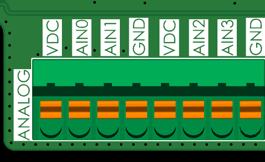
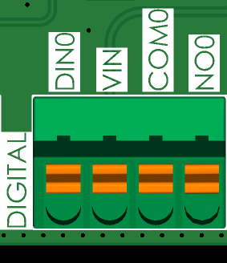
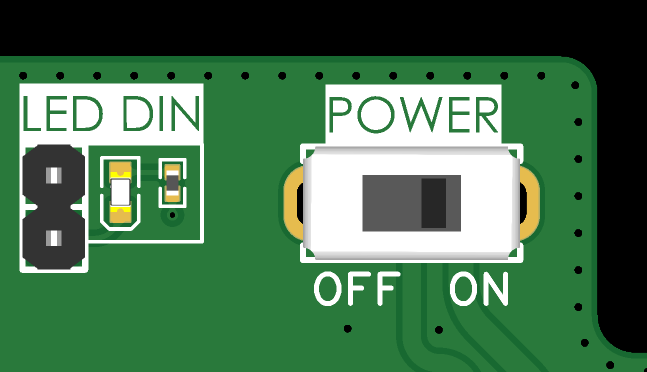
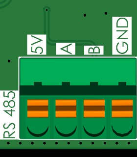
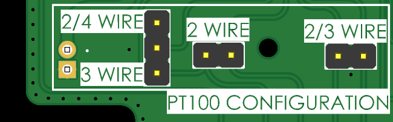
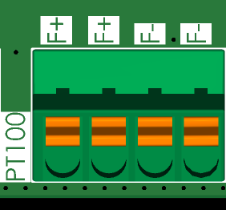
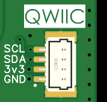
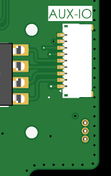
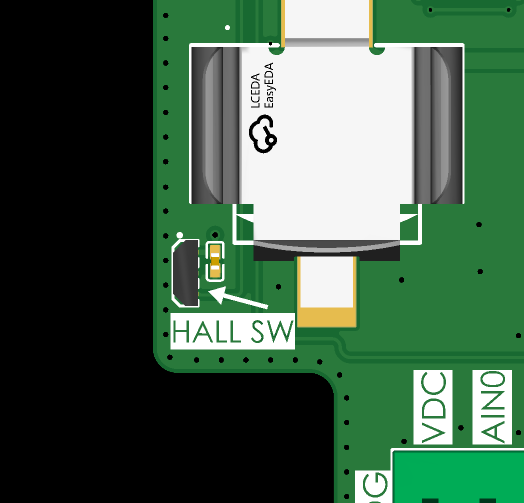
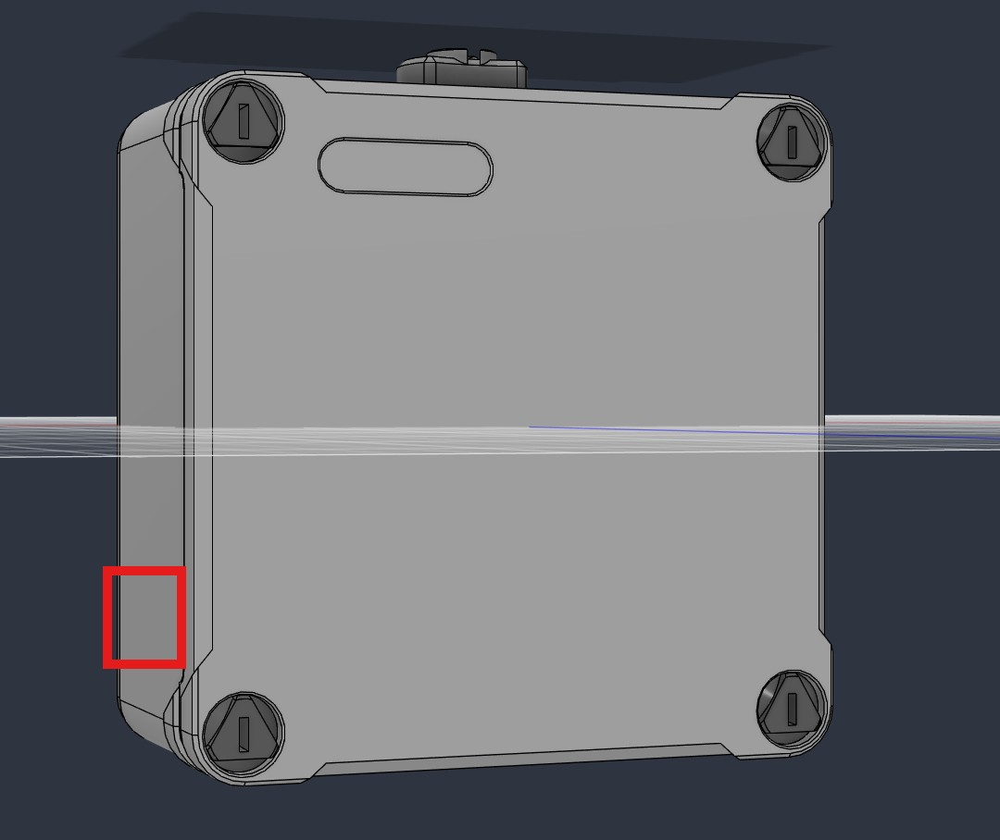

# 1. Conexión de Sensores

El datalogger ISURLOG dispone de múltiples entradas especializadas para integrarse sin complicaciones con distintos sensores industriales y ambientales.

## 1.1. Entradas Analógicas (4-20mA)

El ISURLOG incorpora cuatro entradas analógicas protegidas (AIN0 a AIN3), compatibles tanto con sensores de alimentación activa (externa) como pasiva (suministrada por el propio ISURLOG).

Cada entrada analógica está protegida por un fusible autorrearmable.

| Tipo de Sensor | Esquema de Conexión | Fuente de Alimentación |
| :--- | :--- | :--- |
| **Sensor Pasivo** (bucle de corriente externo) | El (+) del sensor se conecta a **VDC**; el (-) del sensor se conecta a la **AINx** deseada. | Regulador de tensión interno del ISURLOG (VDC). |
| **Sensor Activo** (bucle de corriente interno) | El (+) del sensor se conecta a la **AINx** deseada; el (-) del sensor se conecta a **GND**. | Fuente de alimentación externa. |

{width="500"}

## 1.2. Entrada Digital (Estado y Contador de Pulsos)

El ISURLOG cuenta con una entrada digital de contacto seco, utilizable tanto como lector de estado (abierto/cerrado) como contador de pulsos para dispositivos como caudalímetros o contadores de agua.

La conexión se realiza mediante los pines **VIN** y **DIN0**.

{width="300"}

### Indicador de Estado Digital (LED DIN)

La placa del ISURLOG incluye un LED dedicado (**LED DIN**) que permanece encendido de forma continua cuando la entrada está activa (estado cerrado).

!!! warning "Advertencia de Optimización de Energía"
    Para ahorrar energía en aplicaciones alimentadas por batería, este LED puede desactivarse fácilmente retirando el jumper correspondiente en la PCB.

{width="400"}

## 1.3. Entrada Modbus (RS485)

La interfaz RS485 permite comunicarse con hasta 32 sensores externos mediante el protocolo Modbus. La entrada incluye una **resistencia de terminación de 120 Ohm** integrada.

La conexión utiliza los siguientes pines:

* **Comunicación:** pines **A** y **B**.
* **Alimentación:** la alimentación del sensor puede conectarse al pin **5V** o al pin **VDC** (para el rango de 6 a 24V). El negativo del sensor debe conectarse a **GND**.

{width="300"}

## 1.4. Entrada para Sensor de Temperatura PT100

El ISURLOG admite sondas de temperatura PT100 configuradas a 2, 3 o 4 hilos.

### Requisito de Doble Configuración

Obtener una lectura precisa requiere **dos pasos** de configuración:

1.  **Hardware (Jumpers):** soldar o retirar los jumpers correspondientes en la cara inferior de la PCB.
2.  **Software (Parámetro):** ajustar el número de hilos correcto en la configuración de MicroPython a través de IsurDASH.

| Configuración de Hilos | Jumpers Requeridos | Conexión a F+/F- |
| :--- | :--- | :--- |
| **2 Hilos** | Unir los jumpers **2 WIRE**, **2/3 WIRE** y **2/4 WIRE**. | Los dos hilos del sensor se conectan a F+ y F-. |
| **3 Hilos** | Unir los jumpers **2/3 WIRE** y **3 WIRE**; dejar el resto abiertos. | Conectar los dos hilos comunes (típicamente ≈2Ω) a **F+**. Conectar el tercer hilo (típicamente 100Ω) a **F-**. |
| **4 Hilos** | Unir el jumper **2/4 WIRE**; dejar el resto abiertos. | Conectar cada par de hilos comunes (típicamente ≈2Ω) juntos a **F+** y **F-**. |

{width="300"}
{width="600"}

## 1.5. Salida Digital (Relé)

Junto a la entrada digital, el mismo bloque de terminales también expone una **salida de relé de estado sólido**, mediante los siguientes pines:

* **COM0:** contacto común.
* **NO0:** contacto normalmente abierto.

{width="300"}

Se trata de un **relé de estado sólido con capacidad de 2A / 60V**, adecuado para conmutar directamente cargas externas de mayor potencia (p. ej. bombas, válvulas, contactores u otros actuadores) sin necesidad de un relé intermedio.

## 1.6. Puerto I2C QWIIC

El ISURLOG también expone su bus I2C interno a través de un conector **QWIIC** estándar, para conectar sensores externos y placas de expansión compatibles con QWIIC. La distribución de pines sigue la convención estándar QWIIC: **GND, 3V3, SDA, SCL**.

{width="300"}

!!! note "Nota sobre Alimentación"
    El riel **3V3** de este conector es la alimentación principal de 3.3V del propio datalogger — **no puede desactivarse** por firmware. Si la aplicación requiere bajo consumo, es necesario que el sensor QWIIC conectado disponga de su propio modo de bajo consumo, o contabilizar su consumo en reposo dentro del presupuesto energético.

## 1.7. Conector AUX-IO

El conector AUX-IO es un **conector de paso de 1mm (P=1mm)** que expone señales adicionales del expansor de E/S MCP23008 del ISURLOG — ver [4.5 MCP23008 I/O Expander Pinout](gpio-mapping.md#45-mcp23008-io-expander-pinout).

El **pin 1** está marcado con un triángulo en la serigrafía de la PCB; los pines se numeran a partir de ahí, empezando por la parte inferior del conector en la imagen siguiente.

| Pin | Señal | Descripción |
| :--- | :--- | :--- |
| **1** | 3V3 | Alimentación principal de 3.3V (mismo riel que el conector QWIIC). |
| **2** | NO2 | Contacto normalmente abierto, relé 2 del relé doble de estado sólido integrado (**GAQW212GEH**). |
| **3** | COM2 | Contacto común, relé 2 (**GAQW212GEH**). |
| **4** | NO1 | Contacto normalmente abierto, relé 1 (**GAQW212GEH**). |
| **5** | COM1 | Contacto común, relé 1 (**GAQW212GEH**). |
| **6** | GP3 | MCP23008 GP3 — E/S de propósito general. |
| **7** | GP4 | MCP23008 GP4 — E/S de propósito general. |
| **8** | GP5 | MCP23008 GP5 — E/S de propósito general. |
| **9** | GND | Tierra. |

{width="300"}

## 1.8. Sensores Internos y Diagnóstico

El datalogger incluye dos funciones internas clave para monitorización e interacción en campo:

1.  **Sensor SHT30**
    Este sensor mide la **temperatura y humedad** ambiente *dentro* de la carcasa, actuando como un **sistema de alerta temprana** ante posibles entradas de agua o sobrecalentamiento de componentes, lo que permite mantenimiento preventivo.

2.  **Interruptor de Efecto Hall (Activación Bajo Demanda)**
    El ISURLOG incorpora un interruptor de efecto Hall digital que permite la **interacción manual e instantánea** con el dispositivo mediante un imán. Esta función de "activación bajo demanda" ofrece dos modos de funcionamiento:

    | Modo | Interacción con el Imán | Acción del Datalogger |
    | :--- | :--- | :--- |
    | **Lectura y Envío Inmediato** | Mantener el imán cerca del sensor durante aproximadamente **un segundo**. | El datalogger sale del modo de bajo consumo, realiza un **ciclo completo de lectura de sensores**, y **transmite los datos de inmediato** a la plataforma, sin esperar al siguiente intervalo programado. |
    | **Modo de Diagnóstico Bluetooth** | Mantener el imán cerca del sensor durante **más de cinco segundos**. | El ISURLOG activa su **interfaz Bluetooth** y entra en modo de emparejamiento, permitiendo la conexión directa del personal de campo para configuraciones y visualización de sensores en tiempo real. |

#### Ubicación

El sensor magnético está ubicado en la **esquina inferior izquierda** de la placa PCB, junto al conector de entradas analógicas y el primer compartimento de baterías (contando desde la izquierda).

{width="468" height="642"}

!!! note "Nota para Carcasa IP67"
    En los dataloggers ISURLOG equipados con carcasa IP67, **no es necesario abrir la carcasa** para la activación. El sensor está diseñado para accionarse desde el exterior, acercando un imán a la **parte inferior del panel lateral izquierdo** de la carcasa.

{width="238" height="270"}
